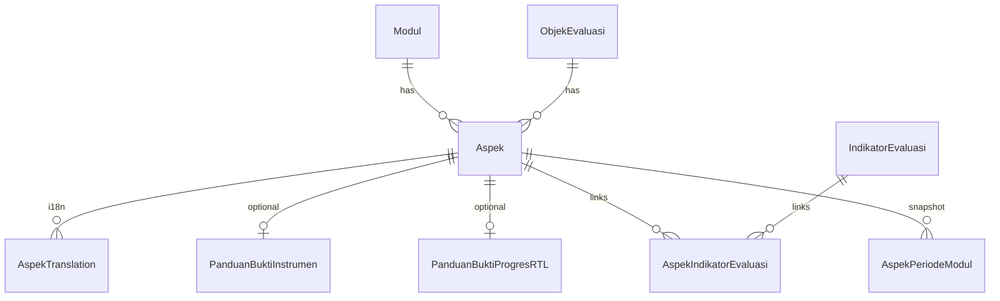
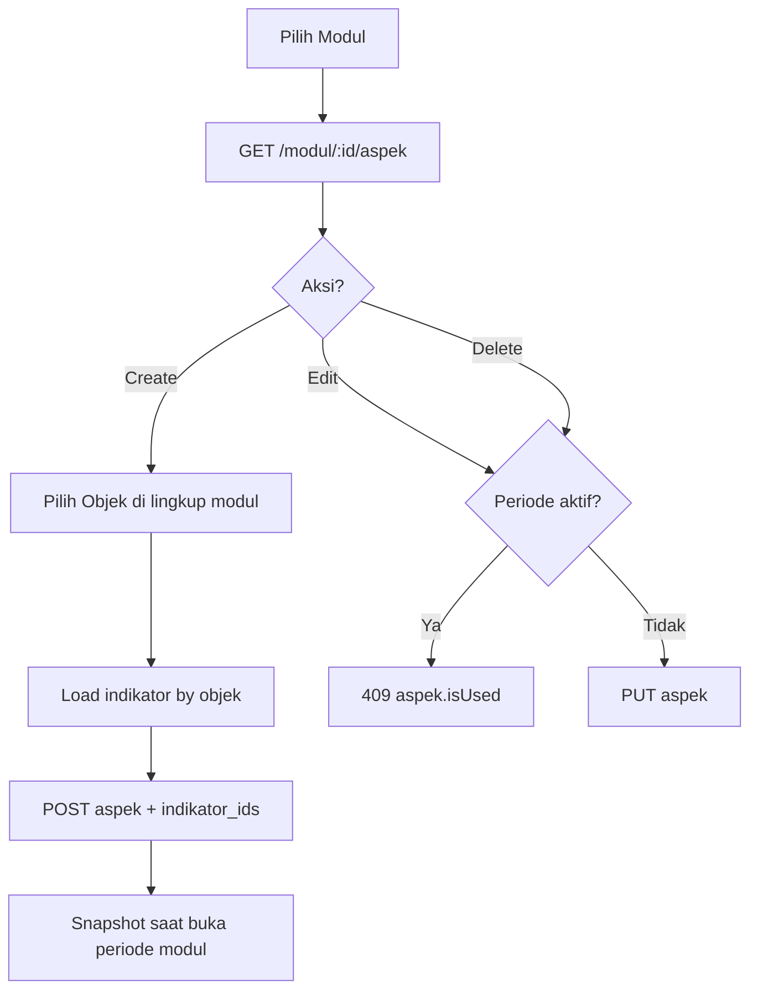

# ASPEK — Frontend Integration Guide

Dokumentasi ini ditujukan untuk **AI agent frontend** dan developer, agar bisa mengintegrasikan UI dengan modul **ASPEK** berdasarkan implementasi aktual di backend (`aspek.controller.ts`, `aspek.service.ts`, `aspek.model.ts`, `aspek.validation.ts`, `schema.prisma`).

## Gambaran singkat

Modul **Aspek** adalah master data yang menghubungkan:

- satu **Modul** evaluasi (`modul_id`),
- satu **Objek Evaluasi** (`objek_evaluasi_id`) yang tersedia di lingkup modul tersebut,
- satu atau lebih **Indikator Evaluasi** (relasi many-to-many lewat `AspekIndikatorEvaluasi`),
- opsional **panduan bukti instrumen** (FM01) dan **panduan bukti progres RTL** (FM04).

Aspek menjadi dasar snapshot saat **periode modul dibuka** (`AspekPeriodeModul`, `IndikatorEvaluasiPeriodeModul`). Tanpa aspek di modul, buka periode gagal (`periodeModul.aspekForPM`).

**Operasi yang tersedia**: list (per modul), detail, create, update, soft delete.

---

## Base URL & header

| Item | Nilai |
|------|--------|
| Base path | `"/api"` (`src/app.ts` → `app.route("/api", AspekController)`) |
| Auth | Semua endpoint: `Authorization: Bearer <token>` |
| Bahasa | `Accept-Language`: `id_ID` \| `en_US` \| `ar_SA` \| `ja_JP` |
| Fallback bahasa | `id_ID` jika header tidak dikenali (`lang.middleware.ts`) |

Field `nama`, `deskripsi`, dan `catatan` panduan di response mengikuti bahasa dari header (terjemahan `AspekTranslation` / panduan translation).

---

## Bentuk response standar

### Success — satu objek

```json
{ "data": { /* AspekResponse */ } }
```

### Success — paging (list)

```json
{
  "data": [ /* AspekResponse[] */ ],
  "meta": {
    "total": 1,
    "page": 1,
    "size": 10,
    "total_pages": 1
  }
}
```

Tipe: `PagingResponse<AspekResponse>` (`src/utils/model-util.ts`). **Bukan** `paging`.

### Success — delete

`204 No Content`, body kosong.

### Error — umum

```json
{ "errors": "<message>" }
```

### Error — validasi Zod (400)

```json
{
  "errors": {
    "formErrors": [],
    "fieldErrors": {
      "nama": ["String must contain at least 1 character(s)"],
      "indikator_evaluasi_ids": ["Array must contain at least 1 element(s)"]
    }
  }
}
```

Handler: `src/app.ts` → `err.flatten()` pada `ZodError`.

---

## Daftar endpoint

### 1) List aspek per modul

| | |
|--|--|
| **Method** | `GET` |
| **URL** | `/api/modul/:modulId/aspek` |
| **Auth** | Login (semua user terautentikasi) |
| **Role middleware** | Tidak ada (hanya `authMiddleware`) |

**Path params**

| Param | Validasi | Wajib |
|-------|----------|-------|
| `modulId` | UUID (`validateId`) | ya |

**Query params**

| Param | Tipe | Default | Keterangan |
|-------|------|---------|------------|
| `page` | number | `1` | Halaman |
| `size` | number | `10` | Ukuran halaman |
| `search` | string | — | Opsional; filter `nama`, `deskripsi`, dan terjemahan (case-insensitive) |
| `order` | `"asc"` \| `"desc"` | `"asc"` | Urut berdasarkan `nama` |

**Fungsi**: Daftar aspek aktif (`deleted_at = null`) untuk modul tertentu. Response di-cache Redis (`AspekRedis`).

**Contoh request**

```http
GET /api/modul/3a0b2c1d-0000-4000-8000-000000000001/aspek?page=1&size=10&search=kualitas&order=asc
Authorization: Bearer <token>
Accept-Language: id_ID
```

**Contoh response (200)**

```json
{
  "data": [
    {
      "id": "aspek-uuid",
      "nama": "Aspek Kualitas Pendidikan",
      "deskripsi": "Deskripsi aspek",
      "panduan_bukti_istrumen": {
        "link": "https://contoh.com/panduan-instrumen",
        "catatan": "Catatan panduan instrumen"
      },
      "panduan_bukti_rtl": {
        "link": "https://contoh.com/panduan-rtl",
        "catatan": "Catatan panduan RTL"
      },
      "total_indikator": 2,
      "indikator": [
        { "id": "indikator-uuid-1" },
        { "id": "indikator-uuid-2" }
      ],
      "objek": {
        "id": "objek-uuid",
        "kode": "OBJ-01",
        "nama": "Objek Evaluasi",
        "deskripsi": "..."
      },
      "created_at": "2026-06-02T00:00:00.000Z",
      "updated_at": "2026-06-02T00:00:00.000Z"
    }
  ],
  "meta": {
    "total": 1,
    "page": 1,
    "size": 10,
    "total_pages": 1
  }
}
```

**Catatan response list**: `modul` **tidak** di-include di query list — hanya `objek` (+ terjemahan). Field `modul` ada pada **detail** dan response **create/update**.

---

### 2) Detail aspek

| | |
|--|--|
| **Method** | `GET` |
| **URL** | `/api/aspek/:aspekId` |
| **Auth** | Login |

**Path params**: `aspekId` (UUID).

**Contoh response (200)**

```json
{
  "data": {
    "id": "aspek-uuid",
    "nama": "Aspek Baru",
    "deskripsi": "Deskripsi Aspek Baru",
    "panduan_bukti_istrumen": {
      "link": "https://contoh.com/panduan-istrumen",
      "catatan": "Catatan untuk panduan bukti istrumen"
    },
    "panduan_bukti_rtl": {
      "link": "https://contoh.com/panduan-rtl",
      "catatan": "Catatan untuk panduan bukti RTL"
    },
    "total_indikator": 1,
    "indikator": [{ "id": "indikator-uuid" }],
    "objek": {
      "id": "objek-uuid",
      "kode": "...",
      "nama": "...",
      "deskripsi": "..."
    },
    "modul": {
      "id": "modul-uuid",
      "nama": "...",
      "deskripsi": "...",
      "tipe_modul": { "kode": "MONEV", "label": "..." }
    },
    "created_at": "2026-06-02T00:00:00.000Z",
    "updated_at": "2026-06-02T00:00:00.000Z"
  }
}
```

---

### 3) Buat aspek

| | |
|--|--|
| **Method** | `POST` |
| **URL** | `/api/modul/:modulId/aspek` |
| **Auth** | Login |
| **Role middleware** | `ADMIN_ROLE` → `ketua-lpm`, `ketua-spi`, `admin-lpm`, `admin-spi` |
| **Validasi body** | `AspekValidation.CREATE` (di service) |

**Path params**: `modulId` (UUID).

**Body** (`CreateAspekRequest`):

| Field | Wajib | Validasi Zod |
|-------|-------|----------------|
| `objek_id` | ya | string, min 1, max 255 (bukan `.uuid()` di Zod; di praktiknya kirim UUID objek) |
| `nama` | ya | min 1, max **50** |
| `deskripsi` | ya | min 1, max **500** |
| `link_panduan_bukti_istrumen` | ya | min **10**, max 255 (bukan validasi `url()` di Zod) |
| `catatan_panduan_bukti_istrumen` | ya | min **10**, max **500** |
| `link_panduan_bukti_rtl` | ya | min **10**, max 255 |
| `catatan_panduan_bukti_rtl` | ya | min **10**, max **500** |
| `indikator_evaluasi_ids` | ya | array string min 1 max 255 per item; **min 1**, **max 30** item |

**Contoh request**

```json
{
  "objek_id": "objek-evaluasi-uuid",
  "nama": "Aspek Baru",
  "deskripsi": "Deskripsi Aspek Baru",
  "link_panduan_bukti_istrumen": "https://contoh.com/panduan-istrumen",
  "catatan_panduan_bukti_istrumen": "Catatan untuk panduan bukti istrumen",
  "link_panduan_bukti_rtl": "https://contoh.com/panduan-rtl",
  "catatan_panduan_bukti_rtl": "Catatan untuk panduan bukti RTL",
  "indikator_evaluasi_ids": ["indikator-evaluasi-uuid"]
}
```

**Contoh response (201)**

```json
{
  "data": { /* AspekResponse lengkap, termasuk modul + objek */ }
}
```

**Side effect backend**: Auto-translate `nama`/`deskripsi` ke semua bahasa (`TranslateClient`); invalidasi cache Redis.

---

### 4) Update aspek

| | |
|--|--|
| **Method** | `PUT` |
| **URL** | `/api/aspek/:aspekId` |
| **Auth** | Login + `ADMIN_ROLE` |
| **Validasi body** | `AspekValidation.UPDATE` |

**Body** (`UpdateAspekRequest`): sama dengan create **tanpa** `objek_id`. Objek evaluasi **tidak dapat diubah** setelah create.

| Field | Wajib | Validasi Zod |
|-------|-------|----------------|
| `nama` | ya | min 1, max 50 |
| `deskripsi` | ya | min 1, max 500 |
| `link_panduan_bukti_istrumen` | ya* | min 10, max 255 |
| `catatan_panduan_bukti_istrumen` | ya* | min 10, max 500 |
| `link_panduan_bukti_rtl` | ya* | min 10, max 255 |
| `catatan_panduan_bukti_rtl` | ya* | min 10, max 500 |
| `indikator_evaluasi_ids` | ya | min 1, max 30 item |

\*Di Zod semua wajib terisi. Di service: jika `link_panduan_bukti_istrumen` / `link_panduan_bukti_rtl` **truthy** → upsert panduan; jika **falsy** → **hapus** record panduan terkait. Karena Zod mensyaratkan min 10 karakter, request valid selalu mengisi link — panduan tidak bisa dihapus lewat API tanpa gagal Zod.

**Relasi indikator**: `deleteMany` + `create` ulang — daftar indikator diganti seluruhnya.

**Contoh response (200)**: `{ "data": AspekResponse }`

---

### 5) Hapus aspek (soft delete)

| | |
|--|--|
| **Method** | `DELETE` |
| **URL** | `/api/aspek/:aspekId` |
| **Auth** | Login + `ADMIN_ROLE` |

**Response**: `204 No Content`.

**Implementasi**: set `deleted_at` (bukan hard delete).

---

## Struktur model & relasi

### Entity `Aspek` (tabel `aspeks`)

| Field DB | Tipe | Wajib | Keterangan |
|----------|------|-------|------------|
| `id` | UUID | auto | PK |
| `modul_id` | UUID | ya | FK → `Modul` |
| `objek_evaluasi_id` | UUID | ya | FK → `ObjekEvaluasi` |
| `nama` | VarChar(255) | ya | Nilai default; response UI pakai terjemahan |
| `deskripsi` | Text | ya | |
| `created_at` | DateTime | auto | |
| `updated_at` | DateTime | auto | |
| `deleted_at` | DateTime? | — | Soft delete |

**Constraint DB**

| Constraint | Dampak |
|------------|--------|
| `@@unique([modul_id, nama])` | Nama aspek unik per modul (duplikat → error Prisma, tidak ada handler khusus `aspek.alreadyExists` di service saat ini) |
| FK `modul_id`, `objek_evaluasi_id` | Cascade on delete parent |

### Relasi turunan



| Relasi | Model | Unique |
|--------|-------|--------|
| Terjemahan aspek | `AspekTranslation` | `[aspek_id, kode_bahasa]` |
| Panduan instrumen | `PanduanBuktiInstrumen` | `aspek_id` unique (1:1) |
| Panduan RTL | `PanduanBuktiProgresRTL` | `aspek_id` unique (1:1) |
| Indikator | `AspekIndikatorEvaluasi` | `[aspek_id, indikator_evaluasi_id]` |

### `AspekResponse` (API)

| Field | Tipe | Wajib di response | Sumber |
|-------|------|-------------------|--------|
| `id` | string | ya | |
| `nama` | string | ya | Terjemahan `Accept-Language` atau fallback kolom `nama` |
| `deskripsi` | string? | | Terjemahan atau fallback |
| `panduan_bukti_istrumen` | `{ link, catatan }`? | | DB `panduan_bukti_instrumen`; **ejaan API: `istrumen`** |
| `panduan_bukti_rtl` | `{ link, catatan }`? | | DB `panduan_bukti_progres_rtl` |
| `total_indikator` | number? | | Jumlah `aspek_indikator_evaluasis` |
| `indikator` | `{ id }[]`? | | `id` = `indikator_evaluasi_id` |
| `objek` | `ObjekResponse`? | | `id`, `kode`, `nama`, `deskripsi`, … |
| `modul` | `ModulResponse`? | | Hanya detail / create / update |
| `created_at` | string (ISO)? | | |
| `updated_at` | string (ISO)? | | |

Field **tidak** dikembalikan ke client: `modul_id`, `objek_evaluasi_id`, `deleted_at`, raw translation rows.

---

## Validasi Zod (`aspek.validation.ts`)

### `CREATE`

Semua field pada object **wajib** (tidak ada `.optional()`).

### `UPDATE`

Identik dengan `CREATE` kecuali **tanpa** `objek_id`.

### Path UUID

`modulId`, `aspekId` → `validateId`:

- kosong → 400 `"ID is required"`
- bukan UUID → 400 `"Invalid ID format"`

### Validasi bisnis di service (setelah Zod)

| Kondisi | HTTP | Pesan i18n (`id_ID`) |
|---------|------|----------------------|
| Modul tidak ada / soft-deleted | 404 | `modul.notFound` |
| User tidak punya role sesuai **tipe modul** | 403 | `forbidden.basic` |
| Objek tidak ada | 404 | `objek.notFound` |
| Objek tidak ada di lingkup modul | 404 | `objek.notAvailableInModul` |
| Salah satu ID indikator tidak ada | 404 | `indikator.notFound` |
| Indikator tidak milik objek aspek | 404 | `indikator.notInObjek` |
| Aspek tidak ada / deleted | 404 | `aspek.notFound` |
| Update/delete: ada `periode_modul` `BELUM_DIMULAI` atau `SEDANG_BERLANGSUNG` | 409 | `aspek.isUsed` |

### Role: middleware vs service

| Lapisan | MONEV | AMI |
|---------|-------|-----|
| `roleMiddleware(ADMIN_ROLE)` | Lolos jika salah satu dari 4 role admin | Sama |
| `hasAccess` di service (create/update/delete) | Hanya `ketua-lpm` atau `admin-lpm` | Hanya `ketua-spi` atau `admin-spi` |

Contoh: user `ketua-spi` memanggil POST aspek pada modul **MONEV** → middleware **lolos**, service **403** `forbidden.basic`.

### Conditional di service (bukan Zod)

| Aksi | Kondisi |
|------|---------|
| Create panduan instrumen | Hanya jika `link_panduan_bukti_istrumen` truthy setelah parse |
| Create panduan RTL | Hanya jika `link_panduan_bukti_rtl` truthy |
| Update panduan | Truthy link → upsert; falsy → `delete: true` pada relasi |
| Create | `objek_id` harus ada di `lingkup_evaluasi` modul |
| Update/delete | Blokir jika periode modul aktif/menunggu |

### Pesan i18n modul aspek

```typescript
// messages[lang].aspek
notFound: "Aspek tidak ditemukan"
alreadyExists: "Aspek sudah ada"   // ada di i18n, belum dipakai eksplisit di service
isUsed: "Aspek sedang digunakan"
```

Terkait modul lain: `periodeModul.aspekForPM` — tidak bisa buka periode jika modul tanpa aspek.

---

## Flow bisnis & CRUD



### Urutan create (frontend)

1. Pastikan user role cocok dengan `tipe_modul` (bukan hanya “admin” generik).
2. `GET` objek evaluasi yang tersedia di modul (modul objek-evaluasi API — di luar modul aspek).
3. User pilih **satu** objek → set `objek_id`.
4. `GET` indikator untuk objek tersebut → multi-select 1–30 → `indikator_evaluasi_ids`.
5. Isi nama, deskripsi, kedua pasangan link+catatan panduan (min 10 karakter masing-masing).
6. `POST /api/modul/:modulId/aspek`.

### Update

1. `GET /api/aspek/:id` untuk prefill.
2. Cek tidak ada periode modul `BELUM_DIMULAI` / `SEDANG_BERLANGSUNG` pada modul aspek (backend menolak; UI bisa disable tombol edit/hapus).
3. `PUT` — objek tidak bisa diganti; ganti indikator dengan array baru.

### Delete

1. Konfirmasi + cek periode aktif (409).
2. `DELETE` → refresh list (record hilang dari list karena `deleted_at`).

### Dependensi data

| Prasyarat | Modul/API |
|-----------|-----------|
| Modul ada | Master modul |
| Objek di lingkup modul | Objek evaluasi ↔ lingkup modul |
| Indikator milik objek | Indikator evaluasi |
| Buka periode | Minimal 1 aspek per modul (`periode-modul`) |

---

## Error handling & status code

| Code | Penyebab |
|------|----------|
| **400** | Path UUID invalid; body gagal Zod |
| **401** | Tidak login / token invalid (`Unauthorized`) |
| **403** | `roleMiddleware`: pesan `"Forbidden"`; service: `forbidden.basic` (role tidak sesuai tipe modul) |
| **404** | Aspek, modul, objek, indikator tidak ditemukan / tidak cocok |
| **409** | `aspek.isUsed` — update/delete saat periode modul aktif atau belum dimulai |
| **201** | Create sukses |
| **200** | GET / PUT sukses |
| **204** | Delete sukses |

**Contoh 403 (middleware)**

```json
{ "errors": "Forbidden" }
```

**Contoh 404 (service)**

```json
{ "errors": "Objek Evaluasi tidak tersedia di modul ini" }
```

**Contoh 409**

```json
{ "errors": "Aspek sedang digunakan" }
```

---

## Catatan implementasi frontend

### Form create / edit

| Field UI | Create | Update | Readonly |
|----------|--------|--------|----------|
| Modul | dari route/context | — | ya |
| Objek evaluasi | select | **readonly** (tidak di body PUT) | ya setelah create |
| `nama` | input max 50 | input max 50 | — |
| `deskripsi` | textarea max 500 | sama | — |
| Panduan instrumen (link + catatan) | wajib, min 10 char | wajib Zod | — |
| Panduan RTL (link + catatan) | wajib, min 10 char | wajib Zod | — |
| Indikator | multi-select 1–30 | multi-select 1–30 | tampilkan `total_indikator` |
| `id`, timestamps | — | — | auto dari API |

**Typo API yang harus dipatuhi client**: `link_panduan_bukti_**istrumen**`, `catatan_panduan_bukti_**istrumen**`, response `panduan_bukti_**istrumen**` (bukan `instrumen`).

### List / table

- Pagination: `page`, `size`, tampilkan `meta.total_pages`.
- Search: debounce disarankan; backend search `nama` + `deskripsi` + translations.
- Sort: query `order=asc|desc` pada kolom nama (server-side).
- Kolom disarankan: nama, objek.nama, total_indikator, updated_at, aksi (edit/hapus jika role + periode tidak aktif).

### Dropdown / data relasi

| UI control | Sumber data |
|------------|-------------|
| Objek | API objek evaluasi per lingkup modul |
| Indikator | API indikator per `objek_id` — filter hanya indikator objek yang dipilih |
| Role guard | `modul.tipe_modul`: MONEV → LPM roles; AMI → SPI roles |

### Cache

Backend mem-cache list/detail di Redis. Setelah POST/PUT/DELETE, cache di-invalidate — frontend cukup refetch; jika data terasa stale, retry GET.

---

## Frontend Integration Notes

Ringkasan praktis untuk implementasi tanpa membaca source backend:

1. **Base**: Semua route di `/api`. Header wajib: `Authorization`, `Accept-Language` (`id_ID` recommended).
2. **5 endpoint**: `GET .../modul/:modulId/aspek`, `GET .../aspek/:id`, `POST .../modul/:modulId/aspek`, `PUT .../aspek/:id`, `DELETE .../aspek/:id`.
3. **List response** pakai `meta`, bukan `paging`.
4. **Create body** 8 field + array indikator (1–30). **Update** tanpa `objek_id`.
5. **Validasi UI** mirror Zod: nama ≤50, deskripsi ≤500, link/catatan panduan min 10 char, indikator 1–30.
6. **Authorization ganda**: butuh salah satu `ADMIN_ROLE` **dan** role yang match `tipe_modul` modul.
7. **Edit/hapus** disabled jika modul punya periode `BELUM_DIMULAI` atau `SEDANG_BERLANGSUNG` (anticipate 409).
8. **Wizard create**: Modul → Objek → Indikator (dependent) → Form aspek → POST.
9. **Detail vs list**: untuk breadcrumb modul, gunakan `GET detail` atau simpan `modulId` dari route; list tidak mengembalikan `modul`.
10. **Integrasi periode modul**: aspek master wajib ada sebelum `POST buka-periode`; setelah buka, ubah aspek master terkunci oleh `aspek.isUsed`.
11. **Error display**: Zod → map `fieldErrors`; HTTPException → string di `errors`.
12. **Field names**: gunakan ejaan `istrumen` persis seperti API.

---

## Referensi file sumber

| File | Peran |
|------|-------|
| `aspek.controller.ts` | Route & middleware |
| `aspek.service.ts` | Business logic, i18n errors, Redis |
| `aspek.model.ts` | Request/response types & mapper |
| `aspek.validation.ts` | Zod CREATE / UPDATE |
| `aspek.redis.ts` | Cache list/detail |
| `prisma/schema.prisma` | Model `Aspek`, relasi |
| `src/i18n/*.ts` | Pesan `aspek`, `objek`, `indikator`, `forbidden` |
| `src/middleware/lang.middleware.ts` | Resolusi bahasa |
| `src/app.ts` | Mount `/api`, error handler |
| `src/modules/role/role.model.ts` | `ADMIN_ROLE` |
