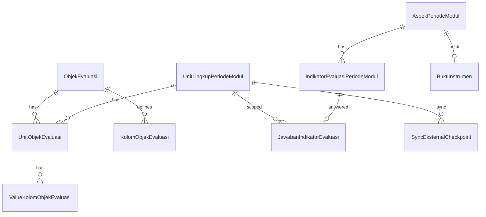
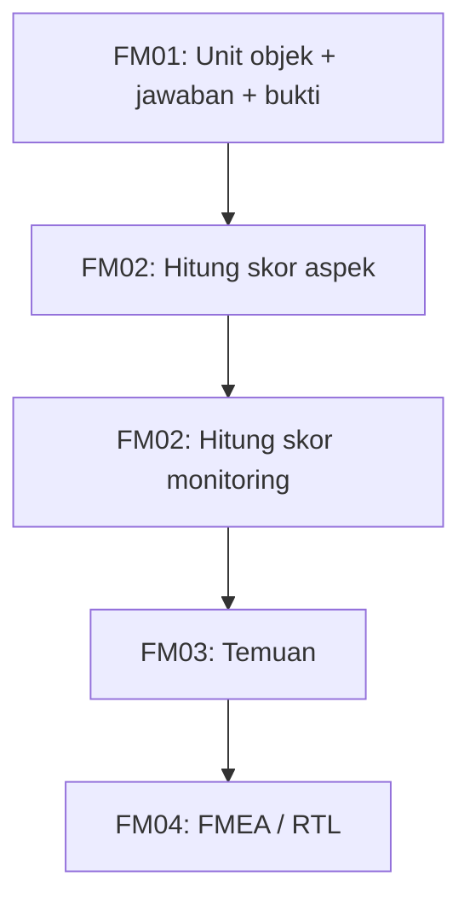

# FM01 — MONITORING (Frontend Integration Guide)

Dokumentasi ini ditujukan untuk **AI agent frontend** dan developer, agar bisa mengintegrasikan UI dengan modul **FM01 MONITORING** berdasarkan implementasi aktual di backend.

## Gambaran singkat

Modul **FM01 MONITORING** (`kode_fm.MONITORING`, urutan 1 — lihat `fm01-monitoring.seed.ts`) adalah formulir untuk **memantau perkembangan evaluasi** pada suatu **unit lingkup periode modul**. Fungsi utamanya:

1. **Unit objek evaluasi** — Auditee mengelola baris data dinamis per `ObjekEvaluasi` (kolom-kolom konfigurasi).
2. **Jawaban indikator** — Evaluator (atau asisten evaluator) mengisi penilaian per indikator (`BINER`, `SKALA`, atau `CEK`).
3. **Bukti instrumen** — Auditee (atau asisten) mengunggah/menyimpan link & catatan bukti per aspek.
4. **Status sync eksternal** — Memantau progres sinkronisasi data objek eksternal (read-only).

Data jawaban disimpan pada level **`unit_lingkup_periode_modul` + `indikator_evaluasi_periode_modul`** (bukan per baris `unit_objek`), meskipun URL jawaban memakai `unitObjekId` sebagai penanda konteks unit.

Hasil monitoring ini menjadi **input FM02** (perhitungan skor aspek/monitoring).

## Base URL & Header penting

- **Base path**: prefix `"/api"` (`src/app.ts`).
- **Auth**: semua endpoint memakai `authMiddleware` → `Authorization: Bearer <token>`.
- **Bahasa**: header `Accept-Language` → `id_ID` | `en_US` | `ar_SA` | `ja_JP` (fallback `id_ID`, `src/middleware/lang.middleware.ts`).

## Bentuk response standar

### Success (object)

```json
{ "data": { } }
```

atau

```json
{ "data": [ ] }
```

### Success (paging + header kolom)

```json
{
  "header": [ { "id": "...", "key": "...", "label": "..." } ],
  "data": [ { "id": "...", "value_koloms": [ { "id": "kolom-uuid", "key": "...", "value": "..." } ] } ],
  "meta": { "total": 1, "page": 1, "size": 10, "total_pages": 1 }
}
```

### Success (mutasi tanpa body)

- **Status**: `204 No Content`
- **Body**: kosong

### Error

```json
{ "errors": "<message>" }
```

atau validasi Zod (400):

```json
{ "errors": { "formErrors": [], "fieldErrors": { "catatan": ["..."] } } }
```

---

## Daftar endpoint (FM01)

> **Catatan path**: beberapa route memakai segment `unit-lingkup` (tanpa `-periode-modul`), yang tetap merujuk ke **`unit_lingkup_periode_modul.id`**.

### 1) Get informasi FM01

- **Method**: `GET`
- **URL**: `/api/fm1/periode-modul/:periodeModulId/unit-lingkup/:unitPeriodeModulId/informasi`
- **Fungsi**: Header halaman — periode modul, unit, status FM **MONITORING**.
- **Path params**: `periodeModulId`, `unitPeriodeModulId` (uuid)
- **Response (200)**: `{ "data": FMInformationResponse }`

---

### 2) Get informasi aspek (detail aspek + indikator + bukti)

- **Method**: `GET`
- **URL**: `/api/fm1/aspek-periode-modul/:aspekPeriodeModulId/unit-lingkup-periode-modul/:unitLingkupPeriodeModulId`
- **Fungsi**: Detail `AspekPeriodeModul` termasuk objek evaluasi, daftar indikator periode modul, dan bukti instrumen unit (jika ada).
- **Response (200)**: `{ "data": AspekPeriodeModulResponse }` (dari `periode-modul.model.ts`)

Contoh struktur ringkas:

```json
{
  "data": {
    "id": "aspek-periode-modul-uuid",
    "aspek": { "id": "...", "nama": "...", "deskripsi": "..." },
    "objek": { "id": "objek-evaluasi-uuid", "nama": "...", "kode": "..." },
    "indikator_periode_modul": [
      {
        "id": "indikator-periode-modul-uuid",
        "indikator": {
          "id": "...",
          "nama": "...",
          "tipe_evaluasi": "SKALA"
        }
      }
    ],
    "bukti_instrumen": {
      "id": "...",
      "link": "https://...",
      "catatan": "..."
    },
    "created_at": "...",
    "updated_at": "..."
  }
}
```

---

### 3) List unit objek evaluasi (tabel dinamis per objek)

- **Method**: `GET`
- **URL**: `/api/fm1/unit-lingkup-periode-modul/:unitLingkupPeriodeModulId/objek/:objekId/unit-objek`
- **Fungsi**: Data tabular: definisi kolom (`header`) + baris nilai (`data`) untuk satu `objek_evaluasi` pada unit.
- **Path params**:
  - `unitLingkupPeriodeModulId` (uuid)
  - `objekId` = **`objek_evaluasi.id`** (bukan id aspek)
- **Query params**:
  - `page` (default `1`), `size` (default `10`)
  - `search` (optional) — cari di `value_string` kolom
  - `order` (`asc` | `desc`, default `asc`) — order by `created_at` baris
  - `is_all_evaluated` (optional) — `"true"` | `"false"` — filter baris berdasarkan kelengkapan jawaban indikator terkait objek
- **Response (200)**:

```json
{
  "header": [
    { "id": "kolom-uuid", "key": "nama_prodi", "label": "Nama Prodi" }
  ],
  "data": [
    {
      "id": "unit-objek-uuid",
      "value_koloms": [
        { "id": "kolom-uuid", "key": "nama_prodi", "value": "Teknik Informatika" }
      ]
    }
  ],
  "meta": { "total": 1, "page": 1, "size": 10, "total_pages": 1 }
}
```

---

### 4) Get jawaban indikator (form penilaian per unit objek)

- **Method**: `GET`
- **URL**: `/api/fm1/aspek-periode-modul/:aspekPeriodeModulId/unit-objek/:unitObjekId/jawaban`
- **Fungsi**: Daftar semua indikator pada objek terkait + opsi penilaian + jawaban existing (jika ada).
- **Path params**:
  - `aspekPeriodeModulId` = id `AspekPeriodeModul`
  - `unitObjekId` = id `UnitObjekEvaluasi`
- **Response (200)**:

```json
{
  "data": [
    {
      "id": "indikator-periode-modul-uuid",
      "indikator": {
        "id": "indikator-uuid",
        "nama": "Indikator A",
        "deskripsi": "...",
        "tipe_evaluasi": "SKALA"
      },
      "opsi": {
        "skalas": [
          { "id": "skala-uuid", "nilai": 1, "nama": "Kurang" }
        ],
        "checklists": [
          { "id": "cek-uuid", "nama": "Item checklist" }
        ]
      },
      "jawaban": {
        "id": "jawaban-uuid",
        "selected_biner": null,
        "selected_skala_id": "skala-uuid",
        "selected_checklist_ids": [],
        "catatan": "Catatan minimal 20 karakter"
      },
      "user": { "id": "...", "nama": "...", "email": "..." }
    }
  ]
}
```

**Penting**: `jawaban` di-scope ke **`unit_lingkup_periode_modul`** (diambil dari `unit_objek` → unit), sehingga jawaban yang sama berlaku untuk semua baris unit objek pada unit tersebut untuk indikator yang sama.

---

### 5) Simpan jawaban indikator

- **Method**: `POST`
- **URL**: `/api/fm1/indikator-periode-modul/:indikatorPeriodeModulId/unit-objek/:unitObjekId/jawab`
- **Fungsi**: Upsert `JawabanIndikatorEvaluasi` (+ `JawabanCek` untuk tipe CEK).
- **Path params**:
  - `indikatorPeriodeModulId` — id `IndikatorEvaluasiPeriodeModul`
  - `unitObjekId` — id `UnitObjekEvaluasi` (untuk resolve `unit_lingkup_periode_modul_id`)
- **Body** (`JawabInstrumenRequest`):

| Field | Tipe | Wajib | Validasi Zod (`JAWAB_INSTRUMEN`) |
|-------|------|-------|--------------------------------|
| `catatan` | string | **ya** | `min(20)`, `max(255)` |
| `biner` | boolean | opsional | `z.boolean().optional()` — dipakai service untuk tipe BINER |
| `skala_id` | uuid | opsional | `z.string().uuid().optional()` — untuk SKALA |
| `cek_ids` | uuid[] | opsional | `z.array(z.string().uuid()).optional()` — untuk CEK |

Zod **tidak** memvalidasi bahwa field jawaban sesuai `tipe_evaluasi` indikator; service yang menolak kombinasi salah (di luar scope schema).

- **Contoh request (SKALA)**:

```json
{
  "catatan": "Catatan jawaban untuk indikator evaluasi FM 01",
  "skala_id": "penilaian-skala-uuid"
}
```

- **Contoh request (BINER)**:

```json
{
  "catatan": "Catatan jawaban minimal dua puluh karakter",
  "biner": true
}
```

- **Contoh request (CEK)**:

```json
{
  "catatan": "Catatan jawaban minimal dua puluh karakter",
  "cek_ids": ["penilaian-cek-uuid-1", "penilaian-cek-uuid-2"]
}
```

- **Response**: `204 No Content`
- **Role**: **EVALUATOR** pada unit, atau **asisten** dari evaluator (`asisten_dimiliki`)
- **Status**: `periode_modul` dan FM MONITORING harus `SEDANG_BERLANGSUNG`

---

### 6) List bukti instrumen per aspek (paging)

- **Method**: `GET`
- **URL**: `/api/fm1/unit-lingkup/:unitLingkupPeriodeModulId/bukti`
- **Fungsi**: Daftar semua aspek pada periode modul + panduan bukti + bukti yang sudah diunggah auditee.
- **Query**: `page` (default 1), `size` (default 10), `order` (default asc)
- **Response (200)**:

```json
{
  "data": [
    {
      "aspek": { "id": "...", "nama": "...", "deskripsi": "..." },
      "panduan": {
        "id": "...",
        "link": "https://panduan...",
        "catatan": "Petunjuk pengisian"
      },
      "bukti_instrumen": {
        "id": "...",
        "link": "https://example.com/bukti",
        "catatan": "Catatan bukti",
        "created_at": "...",
        "updated_at": "..."
      }
    }
  ],
  "meta": { "total": 1, "page": 1, "size": 10, "total_pages": 1 }
}
```

`bukti_instrumen` dapat `null` jika belum diisi.

---

### 7) Simpan bukti instrumen per aspek

- **Method**: `POST`
- **URL**: `/api/fm1/aspek/:aspekPeriodeModulId/unit-lingkup/:unitLingkupPeriodeModulId/bukti`
- **Body** (`SimpanBuktiInstrumenRequest`):

| Field | Tipe | Wajib | Validasi |
|-------|------|-------|----------|
| `link` | string (URL) | ya | url, max 255 |
| `catatan` | string | ya | min 1, max 2000 |

```json
{
  "link": "https://example.com/bukti",
  "catatan": "Catatan bukti instrumen"
}
```

- **Response**: `204 No Content` (create atau update jika sudah ada)
- **Role**: **AUDITEE** atau asisten auditee
- **Unique DB**: satu bukti per `(unit_lingkup_periode_modul_id, aspek_periode_modul_id)`

---

### 8) Buat unit objek evaluasi

- **Method**: `POST`
- **URL**: `/api/fm1/unit-lingkup-periode-modul/:unitLingkupPeriodeModulId/objek/:objekId/unit-objek`
- **Body** (`UpsertUnitObjekEvaluasiRequest`):

```json
{
  "values": [
    { "kolom_id": "kolom-uuid", "value": "Nilai teks" },
    { "kolom_id": "kolom-angka-uuid", "value": 42 }
  ]
}
```

| Field | Validasi |
|-------|----------|
| `values` | array min 1 item |
| `values[].kolom_id` | uuid |
| `values[].value` | any, nullable — disimpan sesuai `tipe_data` kolom (`STRING`, `NUMBER`, `BOOLEAN`, `DATETIME`) |

- **Response**: `204 No Content`
- **Role**: **AUDITEE** atau asisten auditee

---

### 9) Update unit objek evaluasi

- **Method**: `PUT`
- **URL**: `/api/fm1/unit-objek/:unitObjekId`
- **Body**: sama dengan create (`UpsertUnitObjekEvaluasiRequest`)
- **Response**: `204 No Content`
- **Role**: **AUDITEE** atau asisten

---

### 10) Hapus unit objek evaluasi (soft delete)

- **Method**: `DELETE`
- **URL**: `/api/fm1/unit-objek/:unitObjekId`
- **Response**: `204 No Content`
- **Role**: **AUDITEE** atau asisten

---

### 11) Status sinkronisasi eksternal

- **Method**: `GET`
- **URL**: `/api/fm1/unit-lingkup-periode-modul/:unitLingkupPeriodeModulId/sync-status`
- **Fungsi**: Daftar checkpoint sync per objek eksternal pada unit.
- **Response (200)**:

```json
{
  "data": [
    {
      "objek_evaluasi_id": "objek-uuid",
      "objek_evaluasi_nama": "Nama Objek",
      "status": "PENDING",
      "next_page": 1,
      "total_pages": null,
      "processed_records": 0,
      "last_error": null,
      "last_synced_at": null
    }
  ]
}
```

**Enum `status`**: `PENDING` | `RUNNING` | `FAILED` | `COMPLETED`

> Endpoint **trigger sync** (`syncEksternalObjekEvaluasi`) ada di service sebagai kode **dikomentari** — tidak tersedia di controller saat ini.

---

## Struktur model / data

### Entity utama (Prisma)



### `UnitObjekEvaluasi` (`unit_objek_evaluasis`)

| Field | Tipe | Wajib |
|-------|------|-------|
| `id` | uuid | auto |
| `unit_lingkup_periode_modul_id` | uuid | ya |
| `objek_evaluasi_id` | uuid | ya |
| `external_source_id` | uuid? | opsional (objek eksternal) |

### `JawabanIndikatorEvaluasi`

| Field | Tipe | Keterangan |
|-------|------|------------|
| Unique | `(indikator_evaluasi_periode_modul_id, unit_lingkup_evaluasi_periode_modul_id)` | satu jawaban per indikator per unit |
| `biner` | boolean? | tipe BINER |
| `skala_id` | uuid? | tipe SKALA |
| `catatan` | string | wajib di API |
| `jawaban_ceks` | relasi | tipe CEK |

### `BuktiInstrumen`

| Field | Wajib |
|-------|-------|
| `unit_lingkup_periode_modul_id`, `aspek_periode_modul_id`, `user_id` | ya |
| `link`, `catatan` | ya (API) |

### Enum `tipe_evaluasi` (indikator)

| Kode | Field body jawaban |
|------|-------------------|
| `BINER` | `biner` |
| `SKALA` | `skala_id` |
| `CEK` | `cek_ids` |

### Enum `tipe_data` (kolom objek)

`STRING` | `NUMBER` | `BOOLEAN` | `DATETIME` — menentukan kolom value mana yang diisi saat upsert unit objek.

---

## Flow bisnis (untuk UI)

### Flow A — Auditee: kelola data objek & bukti

1. `GET .../informasi` — konteks halaman.
2. Pilih aspek → `GET aspek-periode-modul/...` (indikator + panduan bukti).
3. Kelola tabel objek:
   - `GET .../objek/:objekId/unit-objek` — tampilkan grid.
   - `POST .../unit-objek` — tambah baris.
   - `PUT /fm1/unit-objek/:id` — edit baris.
   - `DELETE /fm1/unit-objek/:id` — hapus baris.
4. Bukti per aspek: `GET /fm1/unit-lingkup/:id/bukti` → `POST .../bukti` per aspek.

### Flow B — Evaluator: isi monitoring indikator

1. Buka baris unit objek → `GET /fm1/unit-objek/:unitObjekId/jawaban`.
2. Render form sesuai `tipe_evaluasi` + `opsi`.
3. Submit → `POST .../indikator-periode-modul/:indikatorPeriodeModulId/unit-objek/:unitObjekId/jawab`.
4. Refresh GET jawaban.

### Flow C — Monitoring sync eksternal

1. `GET .../sync-status` — tampilkan status per objek eksternal.
2. (Trigger sync belum tersedia via API publik.)

### Flow D — Lanjut ke FM02

Setelah semua indikator terjawab (atau placeholder otomatis saat hitung skor), Auditee menjalankan **FM02** `calculate-skor` per aspek lalu monitoring.



---

## Validasi Zod (`fm1.validation.ts`)

Class `FM1Validation` mendefinisikan schema body dan satu helper validasi UUID manual.

### Pemetaan schema → endpoint

| Konstanta | Method + path | Body |
|-----------|---------------|------|
| `JAWAB_INSTRUMEN` | `POST .../indikator-periode-modul/:id/unit-objek/:id/jawab` | `JawabInstrumenRequest` |
| `SIMPAN_BUKTI_INSTRUMEN` | `POST .../aspek/:id/unit-lingkup/:id/bukti` | `{ catatan, link }` |
| `UPSERT_UNIT_OBJEK` | `POST` / `PUT .../unit-objek/:unitObjekId` | `{ values: [...] }` |
| `validateSyncEksternalStatusUnitLingkupPeriodeModulId` | `POST .../sync-status` (query/body id) | Bukan Zod object — `z.string().uuid()` via `safeParse`; gagal → `HTTPException` 400 pesan tetap `"Invalid unit_lingkup_periode_modul_id"` |

Path parameter `:id` / `:unitObjekId` / dll. divalidasi terpisah dengan **`validateId`** (UUID) di controller, bukan di `fm1.validation.ts`.

### `JAWAB_INSTRUMEN`

```typescript
{
  biner?: boolean;
  skala_id?: string;      // uuid
  cek_ids?: string[];     // tiap elemen uuid
  catatan: string;        // wajib, 20–255 karakter
}
```

| Field | Aturan | Pesan Zod tipikal |
|-------|--------|-------------------|
| `catatan` | string, min 20, max 255 | Too small / Too big |
| `biner` | boolean, optional | Invalid type |
| `skala_id` | uuid, optional | Invalid uuid |
| `cek_ids` | array of uuid, optional | Invalid uuid pada elemen |

**Frontend**: `catatan` selalu wajib di form meskipun tipe BINER/SKALA/CEK; panjang 20–255 (bukan 2000 seperti bukti).

### `SIMPAN_BUKTI_INSTRUMEN`

| Field | Aturan |
|-------|--------|
| `catatan` | string, `min(1)`, `max(2000)` |
| `link` | string, `url()`, `max(255)` |

Berbeda dengan jawaban indikator: `catatan` bukti boleh 1 karakter, link harus URL valid (termasuk skema `https://`).

### `UPSERT_UNIT_OBJEK`

| Field | Aturan |
|-------|--------|
| `values` | array, **`min(1)`** — minimal satu baris kolom |
| `values[].kolom_id` | `uuid` |
| `values[].value` | `z.any().nullable()` — tipe bebas/null; service menyesuaikan `tipe_data` kolom master |

Create dan update memakai schema yang sama.

### Error HTTP 400

**Body Zod** (jawab, bukti, unit objek):

```json
{
  "errors": {
    "formErrors": [],
    "fieldErrors": {
      "catatan": ["String must contain at least 20 character(s)"],
      "link": ["Invalid url"]
    }
  }
}
```

**Sync status** (UUID invalid): `{ "errors": "Invalid unit_lingkup_periode_modul_id" }` — bentuk string tunggal, bukan `fieldErrors`.

### Validasi di luar Zod (service)

Zod tidak memeriksa: role, `SEDANG_BERLANGSUNG`, keberadaan indikator/objek, atau kesesuaian `biner`/`skala_id`/`cek_ids` dengan `tipe_evaluasi`. Itu mengembalikan **403** / **404** / **409** dengan pesan i18n.

---

## Validasi & status code

| Code | Penyebab umum |
|------|----------------|
| **400** | UUID invalid; body Zod gagal; sync-status uuid invalid |
| **401** | Tidak login |
| **403** | Role tidak sesuai; FM monitoring bukan `SEDANG_BERLANGSUNG` (beberapa path mengembalikan 403 untuk FM) |
| **404** | Periode modul, aspek, objek, unit tidak ditemukan |
| **409** | `periode_modul` bukan `SEDANG_BERLANGSUNG` saat mutasi |

**Pesan i18n relevan**:

- `objek.notFound`, `aspek.notFound`, `indikator.notFound`
- `lingkup.unitNotFound`, `periodeModul.invalidStatus`
- `forbidden.basic`

---

## Catatan implementasi frontend

### Form fields per fitur

| Fitur | Input UI | Readonly |
|-------|----------|----------|
| Unit objek | Dynamic fields dari `header` (`key`, `label`, `tipe_data` dari master kolom) | `id` baris setelah create |
| Jawaban BINER | `biner`, `catatan` | `indikator.tipe_evaluasi`, opsi dari GET |
| Jawaban SKALA | `skala_id` (radio/select dari `opsi.skalas`), `catatan` | — |
| Jawaban CEK | `cek_ids` (multi-select dari `opsi.checklists`), `catatan` | — |
| Bukti instrumen | `link`, `catatan` | `panduan` dari GET bukti |

### Pagination & filter

| Endpoint | Pagination | Filter / sort |
|----------|------------|---------------|
| `GET .../unit-objek` | `page`, `size`, `meta` | `search`, `order`, `is_all_evaluated` |
| `GET .../bukti` | `page`, `size` | `order` |
| Lainnya | — | — |

### Hak akses ringkas

| Aksi | AUDITEE (+ asisten) | EVALUATOR (+ asisten) | Lainnya (login) |
|------|---------------------|------------------------|-----------------|
| Unit objek CRUD | ✅ | ❌ | ❌ |
| Bukti instrumen POST | ✅ | ❌ | ❌ |
| Jawaban POST | ❌ | ✅ | ❌ |
| GET (semua) | ✅ | ✅ | ✅ |

### ID yang sering tertukar

| UI label | Gunakan di API |
|----------|----------------|
| ID aspek periode modul | `aspekPeriodeModulId` — bukti, info aspek, calculate FM02 |
| ID objek evaluasi | `objekId` pada path `.../objek/:objekId/...` |
| ID unit objek (baris tabel) | `unitObjekId` — jawaban GET/POST, PUT, DELETE |
| ID indikator periode modul | `indikatorPeriodeModulId` — POST jawab (bukan id master indikator) |

### Jawaban level unit

Saat user mengisi jawaban dari baris unit objek A, jawaban tersimpan untuk **seluruh unit**, bukan hanya baris A. UI sebaiknya menampilkan indikator/jawaban di level unit atau menyamakan state antar baris.

### Response mutasi

Mayoritas write operation mengembalikan **204 tanpa body** — refresh data dengan GET terkait.

### Modul berikutnya

- **FM02** membaca `JawabanIndikatorEvaluasi` untuk menghitung skor; pastikan monitoring FM01 selesai atau siap menerima skor minimal otomatis.

---

## Referensi file sumber

| File | Peran |
|------|-------|
| `fm1.controller.ts` | Route definitions |
| `fm1.serivce.ts` | Business logic (nama file typo: `serivce`) |
| `fm1.model.ts` | Request/response types |
| `fm1.validation.ts` | Zod schemas |
| `fm/seeder/seed/fm01-monitoring.seed.ts` | Metadata FM MONITORING |
| `prisma/schema.prisma` | Model terkait |
| `src/middleware/lang.middleware.ts` | Bahasa |
| `src/app.ts` | Mount `/api`, error handler |
