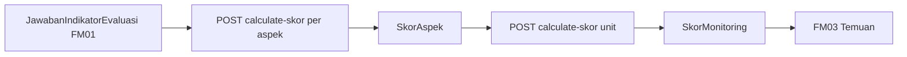
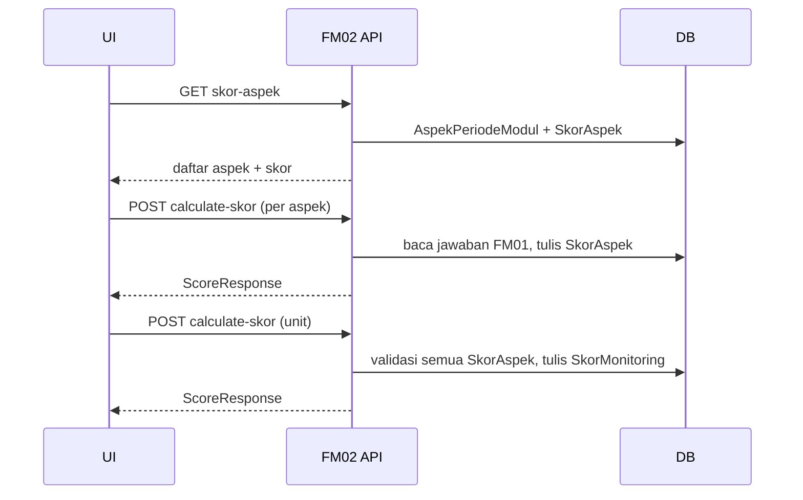

# FM02 — HASIL EVALUASI (Frontend Integration Guide)

Dokumentasi ini ditujukan untuk **AI agent frontend** dan developer, agar bisa mengintegrasikan UI dengan modul **FM02 HASIL EVALUASI** berdasarkan implementasi aktual di backend.

## Gambaran singkat

Modul **FM02 HASIL EVALUASI** menghitung dan menampilkan **skor evaluasi** untuk sebuah **unit lingkup periode modul**, berdasarkan jawaban indikator yang diisi pada modul **FM01 (Monitoring)**:

1. **Skor per aspek** (`SkorAspek`) — agregasi nilai semua indikator pada satu `aspek_periode_modul`.
2. **Skor monitoring keseluruhan** (`SkorMonitoring`) — rata-rata skor semua aspek pada unit tersebut.

Alur bisnis:

- **Auditee** memicu perhitungan skor per aspek (`POST .../calculate-skor` per aspek).
- Setelah **semua aspek** memiliki skor, Auditee memicu perhitungan skor monitoring (`POST .../calculate-skor` di level unit).
- Semua role yang terautentikasi dapat **membaca** skor (GET); perhitungan hanya oleh **Auditee**.

Modul ini **bukan CRUD temuan** — tidak ada create/update/delete entity via FM02. FM03 (Temuan) biasanya dijalankan setelah FM01 selesai dan FM02 menghasilkan skor (lihat `FM3TestUtil.createDefaultFm2WithMonitoringScore`).

## Base URL & Header penting

- **Base path**: prefix `"/api"` (`src/app.ts`).
- **Auth**: semua endpoint FM2 memakai `authMiddleware` → `Authorization: Bearer <token>`.
- **Bahasa**:
  - Header: `Accept-Language` → `id_ID` | `en_US` | `ar_SA` | `ja_JP` (fallback `id_ID`).
  - Label kategori skor diterjemahkan via `kategoriSkorTranslated` (`fm2.util.ts`).

## Bentuk response standar

### Success (single object)

```json
{ "data": { /* object */ } }
```

### Success (array)

```json
{ "data": [ /* array */ ] }
```

### Error (`src/app.ts`)

```json
{ "errors": "<message>" }
```

atau (Zod — **tidak dipakai** di FM02 karena tidak ada request body):

```json
{ "errors": { "formErrors": [], "fieldErrors": {} } }
```

---

## Daftar endpoint (FM02)

### 1) Get informasi FM02

- **Method**: `GET`
- **URL**: `/api/fm2/periode-modul/:periodeModulId/unit-lingkup-periode-modul/:unitLingkupPeriodeModulId/informasi`
- **Fungsi**: Ringkasan periode modul, unit lingkup, dan status FM **HASIL_EVALUASI** (`kode_fm.HASIL_EVALUASI`) untuk header halaman.
- **Path params**:
  - `periodeModulId` (uuid, **required**)
  - `unitLingkupPeriodeModulId` (uuid, **required**)
- **Query / body**: tidak ada
- **Contoh request**:

```http
GET /api/fm2/periode-modul/3a0b.../unit-lingkup-periode-modul/9c12.../informasi
Authorization: Bearer <token>
Accept-Language: id_ID
```

- **Contoh response (200)**: `{ "data": FMInformationResponse }` (struktur dari modul `periode-modul`; field `fm` = HASIL_EVALUASI).

- **Error**: `400` (uuid invalid), `401`, `404` (periode modul tidak ditemukan)

---

### 2) Get skor monitoring (keseluruhan unit)

- **Method**: `GET`
- **URL**: `/api/fm2/unit-lingkup-periode-modul/:unitLingkupPeriodeModulId/skor-monitoring`
- **Fungsi**: Mengambil skor monitoring yang sudah dihitung untuk unit tersebut.
- **Path params**:
  - `unitLingkupPeriodeModulId` (uuid, **required**)
- **Contoh response (200)**:

```json
{
  "data": {
    "skor": 2.5,
    "persentase": 50,
    "kategori": "Cukup"
  }
}
```

| Field response | Tipe | Keterangan |
|----------------|------|------------|
| `skor` | number \| null | Skala ~1–4 (rata-rata skor aspek) |
| `persentase` | number \| null | `((skor - 1) / 3) * 100` |
| `kategori` | string \| null | Label terjemahan: Kurang, Cukup, Baik, Sangat Baik |

- **Error**: `401`, `404` jika record `SkorMonitoring` belum ada (pesan: `lingkup.unitNotFound`)

---

### 3) Get daftar skor per aspek

- **Method**: `GET`
- **URL**: `/api/fm2/unit-lingkup-periode-modul/:unitLingkupPeriodeModulId/skor-aspek`
- **Fungsi**: Menampilkan semua `aspek_periode_modul` pada periode modul terkait unit, beserta skor aspek (jika sudah dihitung).
- **Path params**:
  - `unitLingkupPeriodeModulId` (uuid, **required**)
- **Contoh response (200)**:

```json
{
  "data": [
    {
      "id": "aspek-uuid",
      "nama": "Nama Aspek",
      "deskripsi": "Deskripsi aspek",
      "aspek_periode_modul_id": "aspek-periode-modul-uuid",
      "skor": {
        "skor": 1,
        "persentase": 0,
        "kategori": "Kurang"
      }
    }
  ]
}
```

| Field | Tipe | Wajib di response |
|-------|------|-------------------|
| `id` | string | ya (id master `Aspek`) |
| `nama`, `deskripsi` | string | ya |
| `aspek_periode_modul_id` | string | ya (id `AspekPeriodeModul`, dipakai untuk `POST calculate-skor`) |
| `skor` | `ScoreResponse` | opsional — ada jika `SkorAspek` sudah dibuat |

- **Catatan**: Jika aspek belum dihitung, `skor` bisa tidak ada atau nested dengan nilai null (tergantung ada/tidaknya record `skor_aspeks`).
- **Error**: `401`, `404` jika tidak ada aspek pada periode modul unit tersebut

---

### 4) Hitung skor satu aspek

- **Method**: `POST`
- **URL**: `/api/fm2/unit-lingkup-periode-modul/:unitLingkupPeriodeModulId/aspek-periode-modul/:aspekPeriodeModulId/calculate-skor`
- **Fungsi**: Menghitung dan menyimpan `SkorAspek` untuk kombinasi unit + aspek.
- **Path params**:
  - `unitLingkupPeriodeModulId` (uuid, **required**)
  - `aspekPeriodeModulId` (uuid, **required**)
- **Body**: tidak ada
- **Prasyarat data**: Jawaban indikator dari **FM01** (`JawabanIndikatorEvaluasi`) pada unit yang sama. Jika indikator belum punya jawaban, backend **membuat jawaban placeholder** otomatis dengan skor minimal.
- **Business rules**:
  - Hanya **AUDITEE** pada unit (`403` jika bukan).
  - `periode_modul.status_pelaksanaan` = `SEDANG_BERLANGSUNG` (`409`).
  - FM HASIL_EVALUASI = `SEDANG_BERLANGSUNG` (`409`).
  - Skor aspek untuk pasangan unit+aspek belum pernah dihitung (`409` `score.alreadyCalculated`).
- **Logika perhitungan** (ringkas):
  - Per indikator, skor 1–4 berdasarkan `tipe_evaluasi`:
    - **BINER**: `true` → 4, else → 1
    - **SKALA**: normalisasi linear nilai skala ke rentang 1–4
    - **CEK**: proporsi checklist terpilih → 1–4
  - Skor aspek = rata-rata skor indikator (min 1 jika tidak ada indikator).
  - `persentase` = `((skor - 1) / 3) * 100`
  - **Kategori aspek** (berdasarkan `persentase`):
    - ≥ 90 → `SANGAT_BAIK`
    - ≥ 75 → `BAIK`
    - ≥ 50 → `CUKUP`
    - else → `KURANG`
- **Contoh response (200)**:

```json
{
  "data": {
    "skor": 1,
    "persentase": 0,
    "kategori": "Kurang"
  }
}
```

- **Error**: `401`, `403`, `404` (aspek/unit tidak ditemukan), `409` (status FM/periode atau skor sudah ada)

---

### 5) Hitung skor monitoring (agregat unit)

- **Method**: `POST`
- **URL**: `/api/fm2/unit-lingkup-periode-modul/:unitLingkupPeriodeModulId/calculate-skor`
- **Fungsi**: Menghitung dan menyimpan `SkorMonitoring` dari rata-rata semua `SkorAspek` pada unit.
- **Path params**:
  - `unitLingkupPeriodeModulId` (uuid, **required**)
- **Body**: tidak ada
- **Business rules**:
  - Hanya **AUDITEE** (`403`).
  - Status periode modul & FM HASIL_EVALUASI = `SEDANG_BERLANGSUNG` (`409`).
  - `SkorMonitoring` belum pernah dibuat untuk unit (`409` `score.alreadyCalculated`).
  - **Semua** `aspek_periode_modul` pada periode modul harus sudah punya `SkorAspek` (`409` `score.aspectScoreNotComplete`).
- **Logika perhitungan**:
  - `skor` = rata-rata `skor` dari semua `SkorAspek` unit
  - `persentase` = `((skor - 1) / 3) * 100`
  - **Kategori monitoring** (berdasarkan **skor**, bukan persentase):
    - ≥ 3.25 → `SANGAT_BAIK`
    - ≥ 2.5 → `BAIK`
    - ≥ 1.75 → `CUKUP`
    - else → `KURANG`
- **Contoh response (200)**:

```json
{
  "data": {
    "skor": 1,
    "persentase": 0,
    "kategori": "Kurang"
  }
}
```

---

## Struktur model / data

### Enum `kategori_skor`

| Kode DB | Label (id_ID) |
|---------|---------------|
| `KURANG` | Kurang |
| `CUKUP` | Cukup |
| `BAIK` | Baik |
| `SANGAT_BAIK` | Sangat Baik |

### Response types (`fm2.model.ts`)

**`ScoreResponse`** (skor monitoring & hasil hitung aspek):

| Field | Tipe | Keterangan |
|-------|------|------------|
| `skor` | number \| null | Nilai skor |
| `persentase` | number \| null | Persentase 0–100 |
| `kategori` | string \| null | **Label** terjemahan (bukan kode enum) |

**`AspectScoreResponse`** (item pada GET skor-aspek):

| Field | Tipe | Wajib |
|-------|------|-------|
| `id` | string | ya (id `Aspek`) |
| `nama` | string | ya |
| `deskripsi` | string | ya |
| `aspek_periode_modul_id` | string | ya |
| `skor` | `ScoreResponse` | opsional |

### Entity: `SkorAspek` (tabel `skor_aspeks`)

| Field | Tipe | Wajib | Relasi |
|-------|------|-------|--------|
| `id` | uuid | auto | PK |
| `unit_lingkup_evaluasi_periode_modul_id` | uuid | ya | → `UnitLingkupPeriodeModul` |
| `aspek_periode_modul_id` | uuid | ya | → `AspekPeriodeModul` |
| `skor` | Float | ya | |
| `persentase` | Float | ya | |
| `kategori` | `kategori_skor` | ya | |
| `deleted_at` | DateTime? | | soft delete |

**Unique**: `(aspek_periode_modul_id, unit_lingkup_evaluasi_periode_modul_id)` — satu skor per aspek per unit.

### Entity: `SkorMonitoring` (tabel `skor_monitorings`)

| Field | Tipe | Wajib | Relasi |
|-------|------|-------|--------|
| `id` | uuid | auto | PK |
| `unit_lingkup_evaluasi_periode_modul_id` | uuid | ya, **unique** | → `UnitLingkupPeriodeModul` (1:1) |
| `skor`, `persentase`, `kategori` | | ya | sama seperti SkorAspek |

### Relasi alur data



**Input tidak langsung ke FM02**: `IndikatorEvaluasiPeriodeModul`, `JawabanIndikatorEvaluasi` (dikelola FM01).

---

## Flow bisnis (untuk UI)

### Flow A — Auditee: hitung skor aspek

1. Pastikan FM01 monitoring untuk unit sudah diisi (atau siap menerima skor minimal otomatis).
2. `GET .../skor-aspek` → tampilkan daftar aspek; tandai yang belum punya `skor`.
3. Untuk tiap aspek: `POST .../aspek-periode-modul/:aspekPeriodeModulId/calculate-skor` (gunakan `aspek_periode_modul_id` dari response GET).
4. Refresh `GET .../skor-aspek` atau gunakan response POST untuk update UI.

### Flow B — Auditee: hitung skor monitoring

1. Pastikan jumlah `SkorAspek` = jumlah `aspek_periode_modul` pada periode modul.
2. `POST .../calculate-skor` (tanpa `aspekPeriodeModulId` di path).
3. `GET .../skor-monitoring` untuk tampilan ringkasan / dashboard.

### Flow C — Viewer (Evaluator, Reviewer, admin)

- `GET informasi`, `GET skor-aspek`, `GET skor-monitoring` — tanpa pembatasan role khusus di service (cukup login).



---

## Validasi & status code

FM02 **tidak memiliki** file `fm2.validation.ts` — endpoint POST tidak menerima body.

| Code | Penyebab umum |
|------|----------------|
| **400** | UUID path invalid (`validateId`) |
| **401** | Tidak login |
| **403** | POST calculate: user bukan **AUDITEE** pada unit |
| **404** | Periode modul / aspek / unit tidak ditemukan; GET skor-monitoring jika belum pernah dihitung |
| **409** | Periode modul atau FM HASIL_EVALUASI bukan `SEDANG_BERLANGSUNG` |
| **409** | Skor sudah dihitung (`score.alreadyCalculated`) |
| **409** | Hitung monitoring: belum semua aspek punya skor (`score.aspectScoreNotComplete`) |

**Pesan i18n** (`messages[lang].score`):

- `alreadyCalculated`: "Skor sudah dihitung untuk periode modul ini"
- `aspectScoreNotComplete`: "Terdapat aspek yang belum memiliki skor lengkap..."

---

## Catatan implementasi frontend

### Tidak ada form input body pada FM02

- Semua aksi hitung skor hanya **tombol/aksi** yang memanggil POST dengan path params.
- Tidak ada field form wajib di request FM02.

### Field readonly / auto-generated

| Data | Sumber |
|------|--------|
| `skor`, `persentase`, `kategori` | Dihitung backend saat POST |
| Jawaban placeholder indikator | Dibuat otomatis saat hitung aspek jika jawaban FM01 kosong |
| `id` aspek vs `aspek_periode_modul_id` | GET skor-aspek: gunakan **`aspek_periode_modul_id`** untuk POST calculate |

### Pagination, filter, sort

- **Tidak ada** pada endpoint FM02 — daftar aspek dikembalikan sekaligus di `GET skor-aspek`.

### UI yang disarankan

| Layar | Endpoint utama |
|-------|----------------|
| Header FM02 | `GET .../informasi` |
| Tabel skor per aspek | `GET .../skor-aspek` + tombol hitung per baris |
| Kartu skor keseluruhan | `GET .../skor-monitoring` |
| Aksi hitung semua | Loop POST per aspek, lalu POST monitoring |

### Hak akses

| Endpoint | AUDITEE | EVALUATOR / REVIEWER / lain (login) |
|----------|---------|-------------------------------------|
| GET (semua) | ✅ | ✅ |
| POST calculate | ✅ | ❌ 403 |

### Prasyarat modul lain

| Modul | Peran |
|-------|--------|
| **FM01** | Sumber `JawabanIndikatorEvaluasi`; sebaiknya diisi sebelum hitung skor agar hasil representatif |
| **FM03** | Alur test/setup mengasumsikan FM02 sudah menghasilkan `SkorMonitoring` |

### Perbedaan kategori aspek vs monitoring

Frontend **tidak boleh** mengasumsikan threshold kategori sama:

- **Skor aspek**: kategori dari **persentase** (90 / 75 / 50).
- **Skor monitoring**: kategori dari **nilai skor** (3.25 / 2.5 / 1.75).

### Idempotensi

- Setiap aspek hanya bisa dihitung **sekali**; tidak ada endpoint update/recalculate di implementasi saat ini.
- Skor monitoring hanya bisa dibuat **sekali** per unit.

### CORS & header

- Sertakan `Accept-Language` untuk label kategori terjemahan.
- `Authorization` wajib pada semua endpoint.

---

## Referensi file sumber

| File | Peran |
|------|-------|
| `fm2.controller.ts` | Route definitions |
| `fm2.service.ts` | Perhitungan skor, validasi role/status |
| `fm2.model.ts` | `ScoreResponse`, `AspectScoreResponse`, mapper |
| `fm2.util.ts` | Terjemahan `kategori_skor` |
| `fm2.redis.ts` | Cache GET informasi / skor-aspek |
| `prisma/schema.prisma` | `SkorAspek`, `SkorMonitoring` |
| `src/middleware/lang.middleware.ts` | Resolusi bahasa |
| `src/app.ts` | Mount `/api`, error handler |
