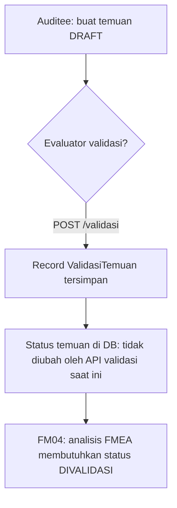

# FM03 — TEMUAN (Frontend Integration Guide)

Dokumentasi ini ditujukan untuk **AI agent frontend** dan developer, agar bisa mengintegrasikan UI dengan modul **FM03 TEMUAN** berdasarkan implementasi aktual di backend.

## Gambaran singkat

Modul **FM03 TEMUAN** menangani pencatatan dan validasi temuan evaluasi pada suatu **unit lingkup periode modul**:

1. **Auditee** membuat temuan (status awal `DRAFT`) terkait sebuah **aspek periode modul**.
2. **Evaluator** melakukan **validasi** temuan (menyimpan record `ValidasiTemuan` beserta catatan & link bukti).
3. Temuan yang sudah divalidasi dapat dilanjutkan ke modul berikutnya (mis. **FM04** membutuhkan status `DIVALIDASI` untuk analisis FMEA).

Modul ini menyediakan endpoint **CRUD** (create, read list/detail, update, delete) dan endpoint **validasi**, dengan dukungan **pagination**, **search**, dan filter **aspek**.

## Base URL & Header penting

- **Base path**: semua endpoint di bawah prefix `"/api"` (lihat `src/app.ts`).
- **Auth**: semua endpoint FM3 memakai `authMiddleware` → wajib `Authorization: Bearer <token>` (jika tidak, 401).
- **Bahasa / i18n**:
  - Backend membaca header: `Accept-Language`.
  - Nilai yang didukung: `id_ID`, `en_US`, `ar_SA`, `ja_JP`.
  - Jika header tidak valid, fallback ke `id_ID` (lihat `src/middleware/lang.middleware.ts`).
  - Label status temuan diterjemahkan via `statusProsesTranslated` (`fm3.util.ts`).

## Bentuk response standar

### Success (single object)

```json
{ "data": { /* object */ } }
```

### Success (paging)

```json
{
  "data": [ /* array */ ],
  "meta": { "total": 1, "page": 1, "size": 10, "total_pages": 1 }
}
```

### Success (delete)

- **Status**: `204 No Content`
- **Body**: kosong (`null`)

### Error (global handler, `src/app.ts`)

- `HTTPException`:

```json
{ "errors": "<message>" }
```

- `ZodError` (400 validation):

```json
{ "errors": { "formErrors": [], "fieldErrors": { "judul": ["..."] } } }
```

---

## Daftar endpoint (FM03)

### 1) Get informasi FM03 untuk konteks unit & periode modul

- **Method**: `GET`
- **URL**: `/api/fm3/periode-modul/:periodeModulId/unit-lingkup-periode-modul/:unitLingkupPeriodeModulId/informasi`
- **Fungsi**: Ringkasan periode modul, unit lingkup, dan status pelaksanaan FM **TEMUAN** (`kode_fm.TEMUAN`) untuk header halaman FM03.
- **Path params**:
  - `periodeModulId` (uuid, **required**)
  - `unitLingkupPeriodeModulId` (uuid, **required**)
- **Contoh request**:

```http
GET /api/fm3/periode-modul/3a0b.../unit-lingkup-periode-modul/9c12.../informasi
Authorization: Bearer <token>
Accept-Language: id_ID
```

- **Contoh response (200)**: `{ "data": FMInformationResponse }` (struktur sama dengan modul periode-modul; field `fm` merujuk ke FM TEMUAN).

- **Kemungkinan error**: `400` (uuid invalid), `401`, `404` (periode modul tidak ditemukan)

---

### 2) List semua temuan (per unit lingkup periode modul)

- **Method**: `GET`
- **URL**: `/api/fm3/unit-lingkup-periode-modul/:unitLingkupPeriodeModulId/temuan`
- **Fungsi**: Daftar semua temuan pada unit (semua status, kecuali soft-deleted).
- **Path params**:
  - `unitLingkupPeriodeModulId` (uuid, **required**)
- **Query params**:
  - `page` (number, default `1`)
  - `size` (number, default `10`)
  - `search` (string, optional) → filter `judul` (case-insensitive, termasuk translation judul)
  - `order` (`asc` | `desc`, default `asc`) → order by `created_at`
  - `aspekPeriodeModulId` (uuid, optional) → filter `aspek_periode_modul_id`
- **Contoh request**:

```http
GET /api/fm3/unit-lingkup-periode-modul/9c12.../temuan?page=1&size=10&order=desc&search=lab&aspekPeriodeModulId=asp...
Authorization: Bearer <token>
Accept-Language: id_ID
```

- **Contoh response (200)**:

```json
{
  "data": [
    {
      "id": "t1...",
      "judul": "Temuan 1",
      "temuan": "Deskripsi temuan 1 minimal 20 karakter",
      "link": "https://contoh.com/temuan-1",
      "status": { "kode": "DRAFT", "label": "Draft" },
      "aspek": { "id": "asp...", "nama": "Nama aspek" },
      "created_at": "2026-06-02T00:00:00.000Z",
      "updated_at": "2026-06-02T00:00:00.000Z"
    }
  ],
  "meta": { "total": 1, "page": 1, "size": 10, "total_pages": 1 }
}
```

---

### 3) List temuan belum divalidasi (status DRAFT)

- **Method**: `GET`
- **URL**: `/api/fm3/unit-lingkup-periode-modul/:unitLingkupPeriodeModulId/temuan/belum-divalidasi`
- **Fungsi**: Daftar temuan dengan `status = DRAFT` pada unit tersebut (cocok untuk antrian validasi evaluator).
- **Query params**: sama dengan endpoint list temuan (`page`, `size`, `search`, `order`, `aspekPeriodeModulId`).

---

### 4) Buat temuan baru

- **Method**: `POST`
- **URL**: `/api/fm3/unit-lingkup-periode-modul/:unitLingkupPeriodeModulId/temuan/create`
- **Fungsi**: Auditee membuat temuan baru (status otomatis `DRAFT`).
- **Path params**:
  - `unitLingkupPeriodeModulId` (uuid, **required**)
- **Body** (`CreateTemuanRequest`):

| Field | Tipe | Wajib | Validasi |
|-------|------|-------|----------|
| `judul` | string | ya | min 3, max 255 |
| `temuan` | string | ya | min 20, max 2000 |
| `link` | string (URL) | ya | url, min 12, max 255 |
| `aspek_peride_modul_id` | uuid | ya | **Perhatikan ejaan field** (`peride`, bukan `periode`) |

- **Business rules**:
  - `aspek_periode_modul` harus ada dan tidak terhapus (`404` aspek tidak ditemukan).
  - Unit lingkup harus terkait dengan aspek tersebut (`404` unit tidak ditemukan).
  - Hanya user dengan role **AUDITEE** pada unit tersebut (`403`).
  - `periode_modul.status_pelaksanaan` harus `SEDANG_BERLANGSUNG` (`409`).
  - FM TEMUAN (`fm_periode_moduls` dengan `kode_fm.TEMUAN`) harus `SEDANG_BERLANGSUNG` (`409`).
- **Contoh request**:

```json
{
  "judul": "Temuan 1",
  "temuan": "Deskripsi temuan 1 minimal 20 karakter",
  "link": "https://contoh.com/temuan-1",
  "aspek_peride_modul_id": "asp-periode-modul-uuid"
}
```

- **Contoh response (201)**:

```json
{
  "data": {
    "id": "t1...",
    "judul": "Temuan 1",
    "temuan": "Deskripsi temuan 1 minimal 20 karakter",
    "link": "https://contoh.com/temuan-1",
    "status": { "kode": "DRAFT", "label": "Draft" },
    "aspek": { "id": "...", "nama": "..." },
    "unit_lingkup": { "id": "...", "nama": "..." },
    "created_at": "2026-06-02T00:00:00.000Z",
    "updated_at": "2026-06-02T00:00:00.000Z"
  }
}
```

---

### 5) Update temuan

- **Method**: `PUT`
- **URL**: `/api/fm3/temuan/:temuanId`
- **Fungsi**: Auditee mengubah temuan yang masih `DRAFT`.
- **Path params**:
  - `temuanId` (uuid, **required**)
- **Body** (`UpdateTemuanRequest`): field sama dengan create (termasuk `aspek_peride_modul_id` di validasi Zod).
- **Catatan implementasi**:
  - Validasi Zod **mensyaratkan** `aspek_peride_modul_id`, tetapi service **hanya meng-update** `judul`, `temuan`, dan `link` — **aspek tidak diubah** di database.
  - Hanya boleh jika `temuan.status === DRAFT` (`409` jika tidak).
  - Role: **AUDITEE**; FM TEMUAN harus `SEDANG_BERLANGSUNG`.
- **Contoh request**:

```json
{
  "judul": "Temuan 1 Updated",
  "temuan": "Deskripsi temuan 1 minimal 20 karakter Updated",
  "link": "https://contoh.com/temuan-1",
  "aspek_peride_modul_id": "asp-periode-modul-uuid"
}
```

- **Contoh response (200)**: `{ "data": TemuanResponse }`

---

### 6) Detail temuan by id

- **Method**: `GET`
- **URL**: `/api/fm3/temuan/:temuanId`
- **Fungsi**: Detail temuan termasuk `hasil_validasi`, `aspek`, dan `unit_lingkup`.
- **Contoh response (200)**:

```json
{
  "data": {
    "id": "t1...",
    "judul": "Temuan 1",
    "temuan": "Deskripsi temuan ...",
    "link": "https://contoh.com/temuan-1",
    "status": { "kode": "DRAFT", "label": "Draft" },
    "aspek": { "id": "...", "nama": "..." },
    "unit_lingkup": { "id": "...", "nama": "..." },
    "hasil_validasi": [
      {
        "id": "v1...",
        "is_validated": true,
        "catatan": "Catatan minimal 20 karakter",
        "link": "https://contoh.com/temuan-1",
        "user": { "id": "u...", "nama": "...", "email": "..." },
        "created_at": "2026-06-02T00:00:00.000Z",
        "updated_at": "2026-06-02T00:00:00.000Z"
      }
    ],
    "created_at": "2026-06-02T00:00:00.000Z",
    "updated_at": "2026-06-02T00:00:00.000Z"
  }
}
```

---

### 7) Validasi temuan

- **Method**: `POST`
- **URL**: `/api/fm3/temuan/:temuanId/validasi`
- **Fungsi**: Evaluator menyimpan hasil validasi (approve/reject) beserta catatan dan link.
- **Path params**:
  - `temuanId` (uuid, **required**)
- **Body** (`CreateValidasiTemuanReqeust` — ejaan type di kode), schema `FM3Validation.VALIDASI` — detail: [Validasi Zod](#validasi-zod-fm3validationts):

| Field | Tipe | Wajib | Validasi Zod |
|-------|------|-------|--------------|
| `is_validated` | boolean | ya | `z.boolean()` |
| `catatan` | string | ya | min 20, max 2000 |
| `link` | string (URL) | ya | `url()`, min 12, max 255 |

- **Business rules**:
  - Temuan harus ada dan `status === DRAFT` (`409` jika sudah bukan draft).
  - Role: **EVALUATOR** pada unit terkait (`403` jika bukan evaluator).
  - FM TEMUAN harus `SEDANG_BERLANGSUNG` (`409`).
- **Perilaku penting (implementasi aktual)**:
  - Service **membuat record** `ValidasiTemuan` dan mengembalikan temuan dengan `hasil_validasi` terisi.
  - Service **tidak meng-update** field `temuan.status` ke `DIVALIDASI` atau `DITOLAK` berdasarkan `is_validated`.
  - Setelah validasi sukses, `status.kode` pada response **tetap** nilai sebelumnya (biasanya masih `DRAFT`).
  - Modul **FM04** memerlukan `temuan.status === DIVALIDASI` untuk analisis FMEA — pastikan alur status diselaraskan dengan kebutuhan bisnis (lihat catatan integrasi FM04).
- **Contoh request**:

```json
{
  "is_validated": true,
  "catatan": "Catatan minimal 20 karakter",
  "link": "https://contoh.com/temuan-1"
}
```

- **Contoh response (200)**: `{ "data": TemuanResponse }` dengan `hasil_validasi` berisi minimal 1 item.

---

### 8) Hapus temuan (soft delete)

- **Method**: `DELETE`
- **URL**: `/api/fm3/temuan/:temuanId`
- **Fungsi**: Soft delete (`deleted_at` di-set) untuk temuan status `DRAFT`.
- **Role**: **AUDITEE**; FM TEMUAN harus `SEDANG_BERLANGSUNG`.
- **Response**: `204 No Content` (tanpa body).

---

## Struktur model / data

### Enum `status_proses` (Temuan)

| Kode | Label (id_ID) | Keterangan |
|------|---------------|------------|
| `DRAFT` | Draft | Default saat create |
| `DIVALIDASI` | Divalidasi | Dipakai FM04 untuk analisis FMEA |
| `DITOLAK` | Revisi | Label UI "Revisi" (bukan "Ditolak") |

### Entity: `Temuan` (tabel `temuans`)

**Relasi (Prisma)**:

```
UnitLingkupPeriodeModul (1) ──< Temuan
AspekPeriodeModul (1) ──< Temuan
User (1) ──< Temuan (pembuat)
Temuan (1) ──< ValidasiTemuan[]
Temuan (0..1) ── AnalisisFMEA
```

**Field database**:

| Field | Tipe | Wajib | Keterangan |
|-------|------|-------|------------|
| `id` | uuid | auto | PK |
| `unit_lingkup_evaluasi_periode_modul_id` | uuid | ya | dari path saat create |
| `aspek_periode_modul_id` | uuid | ya | dari body `aspek_peride_modul_id` |
| `user_id` | uuid | ya | user login (auditee) |
| `judul` | varchar(255) | ya | |
| `temuan` | text | ya | deskripsi temuan |
| `link` | text | ya | URL bukti |
| `status` | `status_proses` | ya | default `DRAFT` |
| `created_at`, `updated_at`, `deleted_at` | datetime | auto | soft delete via `deleted_at` |

**Response** (`TemuanResponse`):

| Field | Tipe | Opsional |
|-------|------|----------|
| `id` | string | — |
| `judul` | string | — |
| `temuan` | string | — |
| `link` | string | — |
| `status` | `{ kode, label }` | — |
| `aspek` | `AspekResponse` | ya |
| `hasil_validasi` | `ValidasiTemuanResponse[]` | ya |
| `unit_lingkup` | `LingkupUnitResponse` | ya |
| `created_at`, `updated_at` | ISO string | ya |

### Entity: `ValidasiTemuan` (tabel `validasi_temuans`)

| Field | Tipe | Wajib |
|-------|------|-------|
| `id` | uuid | auto |
| `temuan_id` | uuid | ya |
| `user_id` | uuid | ya (evaluator) |
| `is_validated` | boolean | ya |
| `catatan` | text | ya |
| `link` | text? | di DB nullable; di API validation **wajib** URL |

**Response** (`ValidasiTemuanResponse`):

- `id`, `is_validated`, `catatan?`, `link?`, `user?`, `created_at`, `updated_at`

### Entity: `TemuanTranslation` / `ValidasiTemuanTranslation`

- Multi-bahasa; backend auto-translate saat create/update via `TranslateClient`.
- Response memakai terjemahan sesuai `Accept-Language`.

---

## Flow bisnis (untuk UI)



### Flow A — Auditee: kelola temuan draft

1. Ambil daftar draft: `GET .../temuan/belum-divalidasi`
2. Buat temuan: `POST .../temuan/create`
3. Edit: `PUT /fm3/temuan/:id` (hanya saat `DRAFT`)
4. Hapus: `DELETE /fm3/temuan/:id` (hanya saat `DRAFT`)

### Flow B — Evaluator: validasi temuan

1. Ambil antrian: `GET .../temuan/belum-divalidasi`
2. Review detail: `GET /fm3/temuan/:id`
3. Submit validasi: `POST /fm3/temuan/:id/validasi`
4. Tampilkan riwayat dari `hasil_validasi[]` pada detail temuan

### Flow C — Monitoring semua temuan

- `GET .../temuan` (semua status, dengan filter aspek & search)

---

## Validasi Zod (`fm3.validation.ts`)

Class `FM3Validation` mengekspor tiga schema statis. Semua mutasi body memakai **`safeParse` / parse** di controller; gagal → **400** dengan `errors` hasil `ZodError.flatten()` (lihat `src/app.ts`).

### Pemetaan schema → endpoint

| Konstanta | HTTP | Path | TypeScript request |
|-----------|------|------|-------------------|
| `CREATE` | `POST` | `.../temuan/create` | `CreateTemuanRequest` |
| `UPDATE` | `PUT` | `/fm3/temuan/:temuanId` | `UpdateTemuanRequest` |
| `VALIDASI` | `POST` | `/fm3/temuan/:temuanId/validasi` | `CreateValidasiTemuanReqeust` |

Path `:unitLingkupPeriodeModulId`, `:temuanId` → **`validateId`** (UUID), bukan di file ini.

### `CREATE` dan `UPDATE` (identik)

| Field | Tipe Zod | Aturan |
|-------|----------|--------|
| `judul` | `z.string()` | min **3**, max **255** |
| `temuan` | `z.string()` | min **20**, max **2000** |
| `link` | `z.string().url()` | URL valid, min **12**, max **255** |
| `aspek_peride_modul_id` | `z.string().uuid()` | UUID — **ejaan field persis seperti API** (`peride`, bukan `periode`) |

**Perbedaan create vs update di service**, bukan di Zod:

- **Create**: `aspek_peride_modul_id` dipakai untuk relasi aspek.
- **Update**: Zod tetap mensyaratkan `aspek_peride_modul_id`, tetapi service **hanya** menulis `judul`, `temuan`, `link`.

Contoh error jika `link` terlalu pendek atau bukan URL:

```json
{
  "errors": {
    "formErrors": [],
    "fieldErrors": {
      "link": ["Invalid url"],
      "temuan": ["String must contain at least 20 character(s)"]
    }
  }
}
```

### `VALIDASI`

| Field | Tipe Zod | Aturan |
|-------|----------|--------|
| `is_validated` | `z.boolean()` | wajib (approve `true` / reject `false`) |
| `catatan` | `z.string()` | min **20**, max **2000** |
| `link` | `z.string().url()` | URL valid, min **12**, max **255** |

Tidak ada field opsional pada schema validasi.

### Ringkasan batasan untuk form UI

| Form | Field | Min length | Max length | Format khusus |
|------|-------|------------|------------|---------------|
| Create / Update | `judul` | 3 | 255 | — |
| Create / Update | `temuan` | 20 | 2000 | — |
| Create / Update | `link` | 12 (string) | 255 | URL |
| Create / Update | `aspek_peride_modul_id` | — | — | UUID |
| Validasi | `catatan` | 20 | 2000 | — |
| Validasi | `link` | 12 | 255 | URL |
| Validasi | `is_validated` | — | — | boolean |

**Tip frontend**: `link` min 12 berarti string panjang setelah validasi URL (mis. `https://a.co` = 12 karakter) — uji di client dengan aturan yang sama agar tidak gagal di submit.

### Validasi di luar Zod

| Aturan | HTTP |
|--------|------|
| Role AUDITEE (CRUD) / EVALUATOR (validasi) | 403 |
| Temuan / aspek / unit tidak ada | 404 |
| Status temuan bukan `DRAFT`, FM/periode bukan `SEDANG_BERLANGSUNG` | 409 |

Zod **tidak** memvalidasi status temuan atau periode; itu di `fm3.service.ts`.

---

## Validasi & status code

| Code | Penyebab umum |
|------|----------------|
| **400** | UUID path invalid; body gagal validasi Zod |
| **401** | Tidak ada / token invalid |
| **403** | Role salah: create/update/delete → butuh **AUDITEE**; validasi → butuh **EVALUATOR** |
| **404** | Temuan / aspek / unit / periode modul tidak ditemukan |
| **409** | Status temuan bukan `DRAFT` (update/delete/validasi); periode modul atau FM TEMUAN tidak `SEDANG_BERLANGSUNG` |
| **204** | Delete sukses |

**Pesan error i18n** (contoh, `messages[lang].temuan`):

- `notFound`: "Temuan tidak ditemukan"
- `invalidStatus`: "Status temuan tidak valid untuk melakukan tindakan ini"

---

## Catatan implementasi frontend

### Form fields

| Aksi | Field input | Readonly / auto |
|------|-------------|-----------------|
| Create temuan | `judul`, `temuan`, `link`, pilih aspek → kirim `aspek_peride_modul_id` | `status` = DRAFT (auto); `id`, timestamps (auto) |
| Update temuan | `judul`, `temuan`, `link` (+ `aspek_peride_modul_id` untuk lolos validasi, tidak mengubah aspek di DB) | `status` tidak diubah via update |
| Validasi | `is_validated`, `catatan`, `link` | `hasil_validasi` diisi backend; `user` evaluator dari backend |

### Pagination, search, sorting

- Gunakan `page`, `size`, `meta.total_pages` pada semua listing.
- `search` memfilter judul (termasuk terjemahan).
- `order` mengurutkan berdasarkan **`created_at`** (bukan judul).
- Filter per aspek: query `aspekPeriodeModulId`.

### Hak akses per role

| Endpoint | AUDITEE | EVALUATOR | Lainnya (mis. admin) |
|----------|---------|-----------|----------------------|
| Create / Update / Delete temuan | ✅ | ❌ 403 | ❌ 403 |
| Validasi temuan | ❌ 403 | ✅ | ❌ 403 |
| GET (list/detail/informasi) | ✅ (login) | ✅ | ✅ |

### Integrasi dengan FM04

- FM04 endpoint `temuan-belum-dianalisis` memfilter `status = DIVALIDASI`.
- Endpoint validasi FM03 **saat ini tidak meng-set** `temuan.status` ke `DIVALIDASI`/`DITOLAK`.
- UI yang mengandalkan status untuk menentukan kelayakan analisis FMEA harus mempertimbangkan perilaku ini (mis. menampilkan status dari `hasil_validasi[].is_validated` sementara, atau menunggu penyelarasan backend).

### Typo field API (wajib dipatuhi client)

- Gunakan **`aspek_peride_modul_id`** (bukan `aspek_periode_modul_id`) pada body create/update agar lolos validasi Zod.

### CORS

- `allowHeaders` di `app.ts` saat ini: `Content-Type`, `Authorization`. Untuk `Accept-Language`, pastikan konfigurasi gateway/proxy mengizinkan header tersebut jika dipakai dari browser.

---

## Referensi file sumber

| File | Peran |
|------|-------|
| `fm3.controller.ts` | Definisi route & binding request |
| `fm3.service.ts` | Business logic, role check, query DB |
| `fm3.model.ts` | Request/response types & mapper |
| `fm3.validation.ts` | Aturan validasi Zod |
| `fm3.util.ts` | Terjemahan label status |
| `prisma/schema.prisma` | Model `Temuan`, `ValidasiTemuan`, relasi |
| `src/middleware/lang.middleware.ts` | Resolusi bahasa |
| `src/app.ts` | Mount `/api`, global error handler |
