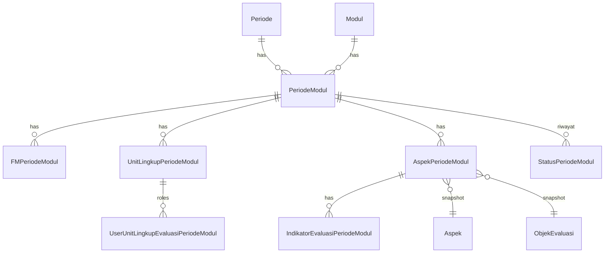
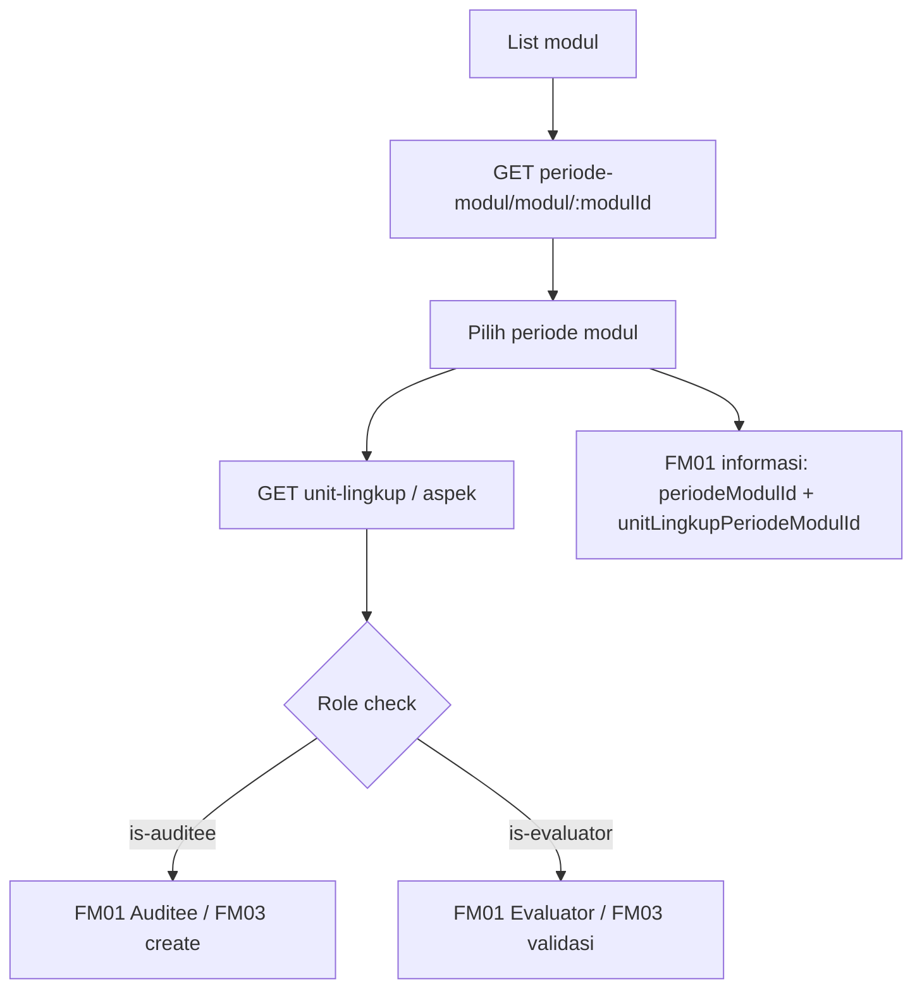

# PERIODE MODUL — Frontend Integration Guide

Dokumentasi ini ditujukan untuk **AI agent frontend** dan developer, agar bisa mengintegrasikan UI dengan modul **PERIODE MODUL** berdasarkan implementasi aktual di backend.

> **Catatan path**: Permintaan menyebut `fm01-monitoring/README.md`, tetapi modul yang dianalisis adalah **`periode-modul`**. Dokumentasi ini disimpan di lokasi yang benar: `src/modules/periode-modul/README.md`.

## Gambaran singkat

Modul **Periode Modul** mengelola **siklus evaluasi** untuk satu **modul** pada **periode akademik aktif**. Saat periode modul dibuka (`buka-periode`), backend:

1. Mengikat modul ke `Periode` yang `is_aktif = true`.
2. Membuat **7 tahapan Form Monitoring (FM)** dengan jadwal masing-masing: Monitoring, Hasil Evaluasi, Temuan, RTL, Berita Acara, Survei, Laporan.
3. Men-generate snapshot **`unit_lingkup_periode_modul`** (beserta role user per unit).
4. Men-generate snapshot **`aspek_periode_modul`** + **`indikator_evaluasi_periode_modul`** dari master modul.

Modul ini menjadi **pintu masuk navigasi** ke FM01–FM04: frontend membutuhkan `periode_modul.id`, `unit_lingkup_periode_modul.id`, dan `aspek_periode_modul.id` dari response modul ini.

## Base URL & Header

- **Base path**: `"/api"`
- **Auth**: semua endpoint memakai `authMiddleware` kecuali yang disebutkan lain.
- **Bahasa**: `Accept-Language` → `id_ID` | `en_US` | `ar_SA` | `ja_JP` (fallback `id_ID`).

## Bentuk response standar

### Success (object)

```json
{ "data": { } }
```

### Success (paging)

```json
{
  "data": [ ],
  "meta": { "total": 1, "page": 1, "size": 50, "total_pages": 1 }
}
```

### Success (mutasi tanpa body)

`204 No Content` — body kosong.

### Error

```json
{ "errors": "<message>" }
```

atau Zod (400):

```json
{ "errors": { "formErrors": [], "fieldErrors": { "monitoring.tanggal_mulai": ["..."] } } }
```

---

## Daftar endpoint

### 1) Buka periode modul (create)

- **Method**: `POST`
- **URL**: `/api/modul/:modulId/buka-periode`
- **Fungsi**: Membuka periode modul baru untuk modul tertentu pada periode akademik aktif; membuat semua entitas turunan (FM, unit, aspek, indikator).
- **Middleware role**: `roleMiddleware(ADMIN_ROLE)` — role: `KETUA_LPM`, `KETUA_SPI`, `ADMIN_LPM`, `ADMIN_SPI`.
- **Validasi bisnis tambahan di service**:
  - Modul **MONEV** → user harus punya role `KETUA_LPM`.
  - Modul **AMI** → user harus punya role `KETUA_SPI`.
- **Path params**: `modulId` (uuid)
- **Body** (`CreatePeriodeModulRequest`):

Setiap tahap FM memakai `PeriodeFMRequest`:

| Field | Tipe | Wajib |
|-------|------|-------|
| `tanggal_mulai` | date (ISO string) | ya |
| `tanggal_selesai` | date (ISO string) | ya |

Tahapan wajib di body (urutan validasi):

| Key body | `kode_fm` |
|----------|-----------|
| `monitoring` | `MONITORING` |
| `hasil_evaluasi` | `HASIL_EVALUASI` |
| `temuan` | `TEMUAN` |
| `rtl` | `RTL` |
| `berita_acara` | `BERITA_ACARA` |
| `survei` | `SURVEI` |
| `laporan` | `LAPORAN` |

**Aturan validasi** (`periode-modul.validation.ts`, schema `PeriodeModulValidation.CREATE`):

| Aturan | Path error Zod | Pesan (contoh) |
|--------|----------------|----------------|
| Monitoring mulai > H+1 dari hari ini | `monitoring.tanggal_mulai` | Tahap monitoring harus dimulai minimal lebih dari 1 hari dari hari ini (H+2) |
| Durasi tiap tahap ≥ 1 hari | `{tahap}.tanggal_selesai` | Tanggal selesai harus minimal sehari setelah tanggal mulai |
| Urutan FM berurutan | `{tahap_berikut}.tanggal_mulai` | `{tahap_berikut} harus dimulai setelah {tahap_sebelumnya} selesai |

Detail per aturan ada di bagian [Validasi Zod](#validasi-zod-periode-modulvalidationts) di bawah.

**Contoh request**:

```json
{
  "monitoring": {
    "tanggal_mulai": "2026-06-04T00:00:00.000Z",
    "tanggal_selesai": "2026-06-05T00:00:00.000Z"
  },
  "hasil_evaluasi": {
    "tanggal_mulai": "2026-06-06T00:00:00.000Z",
    "tanggal_selesai": "2026-06-07T00:00:00.000Z"
  },
  "temuan": {
    "tanggal_mulai": "2026-06-08T00:00:00.000Z",
    "tanggal_selesai": "2026-06-09T00:00:00.000Z"
  },
  "rtl": {
    "tanggal_mulai": "2026-06-10T00:00:00.000Z",
    "tanggal_selesai": "2026-06-11T00:00:00.000Z"
  },
  "berita_acara": {
    "tanggal_mulai": "2026-06-12T00:00:00.000Z",
    "tanggal_selesai": "2026-06-13T00:00:00.000Z"
  },
  "survei": {
    "tanggal_mulai": "2026-06-14T00:00:00.000Z",
    "tanggal_selesai": "2026-06-15T00:00:00.000Z"
  },
  "laporan": {
    "tanggal_mulai": "2026-06-16T00:00:00.000Z",
    "tanggal_selesai": "2026-06-17T00:00:00.000Z"
  }
}
```

**Contoh response (201)** — ringkas:

```json
{
  "data": {
    "id": "periode-modul-uuid",
    "status_pelaksanaan": { "kode": "SEDANG_BERLANGSUNG", "label": "Sedang berlangsung" },
    "periode": { "id": "...", "tahun_ajaran": "2025/2026", "semester": "GANJIL" },
    "modul": { "id": "...", "nama": "...", "tipe_modul": { "kode": "MONEV", "label": "..." } },
    "fm_periode_moduls": [
      {
        "id": "...",
        "fm": { "id": "...", "nama": "Monitoring", "kode": "MONITORING" },
        "tanggal_mulai": "...",
        "tanggal_selesai": "...",
        "status_pelaksanaan": { "kode": "BELUM_DIMULAI", "label": "..." }
      }
    ],
    "unit_lingkup_periode_moduls": [
      {
        "id": "unit-lingkup-periode-modul-uuid",
        "unit_lingkup": {
          "id": "...",
          "nama": "...",
          "auditee": { "id": "...", "nama": "..." },
          "evaluator": { "id": "...", "nama": "..." },
          "reviewer": { "id": "...", "nama": "..." }
        }
      }
    ],
    "status_periode_moduls": [
      { "status_pelaksanaan": { "kode": "...", "label": "..." }, "tanggal": "..." }
    ],
    "created_at": "...",
    "updated_at": "..."
  }
}
```

**Error umum**: `404` (periode aktif / modul / aspek / unit tidak ada), `409` (periode modul aktif sudah ada untuk modul), `403` (role tidak sesuai tipe modul), `400` (validasi tanggal).

---

### 2) Batalkan periode modul

- **Method**: `PUT`
- **URL**: `/api/periode-modul/:periodeModulId/batalkan`
- **Fungsi**: Set status `DIBATALKAN` pada periode modul dan semua `fm_periode_modul`; nonaktifkan `lingkup_evaluasi.is_aktif`.
- **Role**: `ADMIN_ROLE` + validasi KETUA_LPM (MONEV) / KETUA_SPI (AMI) di service.
- **Body**: tidak ada
- **Response**: `204 No Content`
- **Error**: `404`, `409` (sudah dibatalkan), `403`

---

### 3) Update tahapan (sinkron status FM & periode modul)

- **Method**: `PUT`
- **URL**: `/api/periode-modul/:periodeModulId/update-tahapan`
- **Fungsi**: Menghitung ulang `status_pelaksanaan` setiap `FMPeriodeModul` dari tanggal mulai/selesai (atau `tanggal_diselesaikan`), lalu agregasi status `PeriodeModul` + upsert riwayat `StatusPeriodeModul`.
- **Role**: `KETUA_LPM` atau `KETUA_SPI` (`roleMiddleware`).
- **Body**: tidak ada
- **Response**: `204 No Content`
- **Logic status FM** (`getStatusPelaksanaan`):
  - hari ini < mulai → `BELUM_DIMULAI`
  - hari ini >= selesai → `SELESAI`
  - else → `SEDANG_BERLANGSUNG`

---

### 4) List periode modul by modul

- **Method**: `GET`
- **URL**: `/api/periode-modul/modul/:modulId`
- **Fungsi**: Daftar periode modul untuk satu modul (exclude `DIBATALKAN`).
- **Query**: `page` (default 1), `size` (default **50**), `order` (`asc`|`desc`, default `asc`)
- **Response (200)**: `PagingResponse<PeriodeModulResponse>` — item berisi `periode`, `status_pelaksanaan`; tidak selalu include `fm_periode_moduls` / `unit_lingkup` penuh (query minimal).

---

### 5) List aspek per periode modul

- **Method**: `GET`
- **URL**: `/api/periode-modul/:periodeModulId/aspek`
- **Fungsi**: Daftar `AspekPeriodeModul` (untuk navigasi ke FM01 per aspek).
- **Query**: `page`, `size` (default 50), `order`
- **Response (200)**:

```json
{
  "data": [
    {
      "id": "aspek-periode-modul-uuid",
      "aspek": { "id": "...", "nama": "...", "deskripsi": "..." },
      "created_at": "...",
      "updated_at": "..."
    }
  ],
  "meta": { "total": 1, "page": 1, "size": 50, "total_pages": 1 }
}
```

> Endpoint detail aspek (termasuk indikator & bukti) ada di **FM01**: `GET /api/fm1/aspek-periode-modul/:aspekPeriodeModulId/unit-lingkup-periode-modul/:unitLingkupPeriodeModulId`.

---

### 6) List unit lingkup per periode modul

- **Method**: `GET`
- **URL**: `/api/periode-modul/:periodeModulId/unit-lingkup`
- **Fungsi**: Daftar `UnitLingkupPeriodeModul` beserta data unit (auditee, evaluator, reviewer).
- **Query**: `page`, `size` (default 50), `order`
- **Response (200)**:

```json
{
  "data": [
    {
      "id": "unit-lingkup-periode-modul-uuid",
      "unit_lingkup": {
        "id": "...",
        "nama": "...",
        "auditee": { "nama": "...", "email": "..." },
        "evaluator": { "nama": "...", "email": "..." },
        "reviewer": { "nama": "...", "email": "..." }
      },
      "created_at": "...",
      "updated_at": "..."
    }
  ],
  "meta": { "total": 1, "page": 1, "size": 50, "total_pages": 1 }
}
```

**ID `unit-lingkup-periode-modul-uuid`** dipakai di hampir semua route FM01–FM04.

---

### 7) Cek role auditee pada unit

- **Method**: `GET`
- **URL**: `/api/periode-modul/unit-lingkup/:unitLingkupPeriodeModulId/is-auditee`
- **Fungsi**: Apakah user login adalah **AUDITEE** (atau asisten auditee) pada unit tersebut.
- **Middleware**: `authMiddleware` saja (tanpa `langMiddleware`).
- **Response (200)**:

```json
{ "data": { "is_auditee": true } }
```

---

### 8) Cek role evaluator pada unit

- **Method**: `GET`
- **URL**: `/api/periode-modul/unit-lingkup/:unitLingkupPeriodeModulId/is-evaluator`
- **Fungsi**: Apakah user login adalah **EVALUATOR** (atau asisten evaluator).
- **Response (200)**:

```json
{ "data": { "is_evaluator": false } }
```

---

## Struktur model / data

### Diagram relasi utama



### `PeriodeModul` (`periode_moduls`)

| Field | Tipe | Keterangan |
|-------|------|------------|
| `id` | uuid | PK |
| `periode_id` | uuid | Periode akademik aktif saat buka |
| `modul_id` | uuid | Modul master |
| `status_pelaksanaan` | enum | Agregat dari semua FM |
| `deleted_at` | datetime? | soft delete |

### `FMPeriodeModul` (`fm_periode_moduls`)

| Field | Wajib | Keterangan |
|-------|-------|------------|
| `periode_modul_id` | ya | |
| `kode_fm` | ya | 7 kode FM |
| `tanggal_mulai`, `tanggal_selesai` | ya | Jadwal tahapan |
| `status_pelaksanaan` | ya | Dihitung dari tanggal |
| `tanggal_diselesaikan` | opsional | Jika ada, dianggap `SELESAI` saat update tahapan |

### `UnitLingkupPeriodeModul` (`unit_lingkup_periode_moduls`)

| Field | Keterangan |
|-------|------------|
| `periode_modul_id` | |
| `unit_lingkup_evaluasi_id` | Snapshot dari master unit |
| Unique | `(periode_modul_id, unit_lingkup_evaluasi_id)` |

### `AspekPeriodeModul` (`aspek_periode_moduls`)

| Field | Keterangan |
|-------|------------|
| `periode_modul_id`, `aspek_id`, `objek_evaluasi_id` | Snapshot aspek + objek |
| Relasi | `indikator_evaluasi_periode_moduls`, `bukti_instrumens`, `temuans` |

### Response types (`periode-modul.model.ts`)

| Type | Dipakai untuk |
|------|----------------|
| `PeriodeModulResponse` | Detail/list periode modul |
| `FMPeriodeModulResponse` | Jadwal per FM |
| `UnitLingkupPeriodeModulResponse` | Unit + role users |
| `AspekPeriodeModulResponse` | Aspek (+ optional objek, indikator, bukti) |
| `FMInformationResponse` | Header halaman FM01–FM04 (`periode_modul`, `unit_lingkup`, `fm`) |

Enum **`status_pelaksanaan`**: `DIBATALKAN` | `BELUM_DIMULAI` | `SEDANG_BERLANGSUNG` | `SELESAI`

Enum **`tipe_role_lingkup`**: `AUDITEE` | `EVALUATOR` | `REVIEWER`

---

## Flow bisnis (untuk UI)

### Flow A — Admin: buka periode modul

1. Pastikan ada **periode akademik aktif**, modul punya **aspek** dan **unit lingkup** dengan user role lengkap.
2. Form jadwal 7 tahap FM (date range per tahap, urutan tidak overlap).
3. `POST /api/modul/:modulId/buka-periode` → simpan `periode_modul.id` dan daftar `unit_lingkup_periode_moduls[].id`.
4. Tampilkan timeline dari `fm_periode_moduls`.

### Flow B — Navigasi ke FM operasional



| Modul | Endpoint informasi (contoh) | ID dari periode modul |
|-------|----------------------------|------------------------|
| FM01 | `/api/fm1/periode-modul/.../informasi` | `periode_modul.id`, `unit_lingkup_periode_modul.id` |
| FM02 | `/api/fm2/periode-modul/.../informasi` | sama |
| FM03 | `/api/fm3/periode-modul/.../informasi` | sama |
| FM04 | `/api/fm4/periode-modul/.../informasi` | sama |

### Flow C — Sinkron status (cron / tombol admin)

- `PUT /api/periode-modul/:id/update-tahapan` — refresh status FM & periode modul berdasarkan tanggal hari ini.

### Flow D — Batalkan periode

- `PUT /api/periode-modul/:id/batalkan` — modul tidak lagi aktif; listing exclude `DIBATALKAN`.

---

## Validasi Zod (`periode-modul.validation.ts`)

Validasi body **hanya** pada endpoint **buka periode modul** (`POST .../buka-periode`). Class `PeriodeModulValidation` mengekspor satu schema: **`CREATE`**.

### Skema dasar per tahap

Setiap key tahap (`monitoring`, `hasil_evaluasi`, …) memakai objek yang sama:

| Field | Tipe Zod | Keterangan |
|-------|----------|------------|
| `tanggal_mulai` | `z.coerce.date()` | String ISO / timestamp diterima; dikonversi ke `Date` |
| `tanggal_selesai` | `z.coerce.date()` | Sama |

Semua **7 key** wajib ada di body; tidak ada field opsional pada schema ini.

### Aturan `superRefine` (urutan evaluasi di backend)

#### 1) Monitoring minimal H+2

- Backend membandingkan **tanggal kalender** (jam di-reset ke `00:00:00` untuk `hariIni` dan `monitoring.tanggal_mulai`).
- `diffDays = (tanggal_mulai - hariIni) / (ms per hari)`.
- Gagal jika `diffDays <= 1` → artinya mulai besok (H+1) atau hari ini **tidak** lolos; **minimal H+2**.
- Contoh: jika hari ini 2 Juni 2026, `monitoring.tanggal_mulai` paling awal **4 Juni 2026**.

#### 2) Durasi minimal 1 hari per tahap

Untuk setiap tahap dalam daftar: `monitoring`, `hasil_evaluasi`, `temuan`, `rtl`, `berita_acara`, `survei`, `laporan`:

- `diffDays = (tanggal_selesai - tanggal_mulai) / (ms per hari)`.
- Gagal jika `diffDays < 1` (tanggal selesai **sama** dengan mulai tidak lolos).
- Error path: `[nama_tahap, "tanggal_selesai"]`.

#### 3) Urutan FM berurutan

Urutan tetap (sama dengan tabel tahapan di atas):

`monitoring` → `hasil_evaluasi` → `temuan` → `rtl` → `berita_acara` → `survei` → `laporan`

Untuk setiap pasangan berturutan `(current, next)`:

- Gagal jika `next.tanggal_mulai < current.tanggal_selesai` (tanggal mulai tahap berikutnya **sebelum** tanggal selesai tahap sebelumnya).
- Error path: `[next.key, "tanggal_mulai"]`.
- Pesan: `` `${next.key} harus dimulai setelah ${current.key} selesai` `` (mis. `temuan harus dimulai setelah hasil_evaluasi selesai`).

**Catatan**: Perbandingan memakai objek `Date` penuh (termasuk jam dari `coerce.date`), bukan hanya tanggal kalender — kirim ISO dengan konsisten agar tidak terjadi off-by-one di timezone.

### Bentuk error HTTP 400 (Zod)

Handler global (`src/app.ts`) mengembalikan:

```json
{
  "errors": {
    "formErrors": [],
    "fieldErrors": {
      "monitoring": ["Tahap monitoring harus dimulai minimal lebih dari 1 hari dari hari ini (H+2)"],
      "hasil_evaluasi": ["Tanggal selesai harus minimal sehari setelah tanggal mulai"]
    }
  }
}
```

Path nested (`monitoring.tanggal_mulai`) dapat muncul sebagai key gabungan tergantung `flatten()` Zod — UI sebaiknya menampilkan `fieldErrors` per key dan memetakan ke field form timeline.

### Endpoint lain (tanpa schema Zod di modul ini)

| Endpoint | Validasi path |
|----------|----------------|
| `GET/PUT` dengan `:id` | `validateId` → UUID, 400 jika invalid |
| `buka-periode` | `PeriodeModulValidation.CREATE` |
| Service `bukaPeriodeModul` | Prasyarat aspek/unit, role ketua, tidak ada periode aktif (`409`) — **di luar** Zod |

---

## Validasi & status code

| Code | Penyebab |
|------|----------|
| **400** | Validasi Zod tanggal; UUID invalid |
| **401** | Tidak login / token invalid |
| **403** | Role middleware atau KETUA_LPM/SPI tidak sesuai tipe modul |
| **404** | Periode aktif tidak ada, modul tidak ada, tidak ada aspek/unit, list kosong |
| **409** | Periode modul aktif sudah ada (`existsForPM`); sudah dibatalkan |

**Pesan i18n** (`messages[lang].periodeModul`):

- `notFound`, `existsForPM`, `isAlreadyCancel`, `aspekForPM`, `unitForPM`, `invalidStatus`

---

## Catatan implementasi frontend

### Form buka periode modul

| UI section | Field input | Readonly / auto |
|------------|-------------|-----------------|
| Monitoring | `tanggal_mulai`, `tanggal_selesai` | min mulai H+2 |
| Hasil evaluasi … Laporan | pasangan tanggal per tahap | urutan FM fixed |
| — | — | `periode_modul.id`, FM ids, unit ids → dari response 201 |

Tampilkan **7 baris timeline** sesuai urutan validasi. Validasi client-side disarankan mirror backend (urutan + durasi minimal 1 hari).

### Pagination

| Endpoint | Default `size` |
|----------|----------------|
| `GET .../modul/:modulId` | 50 |
| `GET .../aspek` | 50 |
| `GET .../unit-lingkup` | 50 |

Tidak ada `search` pada endpoint periode modul.

### Role & guard UI

- Gunakan `is-auditee` / `is-evaluator` sebelum menampilkan aksi FM.
- **Asisten** diperlakukan sama seperti pemilik role (evaluator/auditee) di backend.
- Buka/batalkan periode: butuh role admin (`ADMIN_ROLE`) + ketua sesuai tipe modul.

### ID untuk routing FM

| Kebutuhan UI | Ambil dari |
|--------------|------------|
| Route FM01–04 informasi | `periode_modul.id` + `unit_lingkup_periode_modul.id` |
| Pilih aspek | `aspek_periode_modul.id` dari `GET .../aspek` |
| Objek evaluasi FM01 | `objek_evaluasi.id` dari detail aspek (FM01) atau master modul |

### Email

Setelah `buka-periode` sukses, backend memanggil `sendOpenModulPeriodEmail` (async queue) — tidak mempengaruhi response API.

### Prasyarat master data

Sebelum buka periode, modul harus memiliki:

- Minimal 1 **aspek** dengan indikator terhubung.
- Minimal 1 **unit lingkup evaluasi** dengan user AUDITEE, EVALUATOR, REVIEWER.

---

## Referensi file sumber

| File | Peran |
|------|-------|
| `periode-modul.controller.ts` | Routes |
| `periode-modul.service.ts` | Business logic |
| `periode-modul.model.ts` | Types & mappers |
| `periode-modul.validation.ts` | Zod create |
| `periode-modul.util.ts` | `getStatusPelaksanaan` |
| `fm/seeder/seed/fm01-monitoring.seed.ts` | Metadata FM (urutan 1) — bagian dari 7 FM |
| `prisma/schema.prisma` | Model DB |
| `src/middleware/lang.middleware.ts` | Bahasa |
